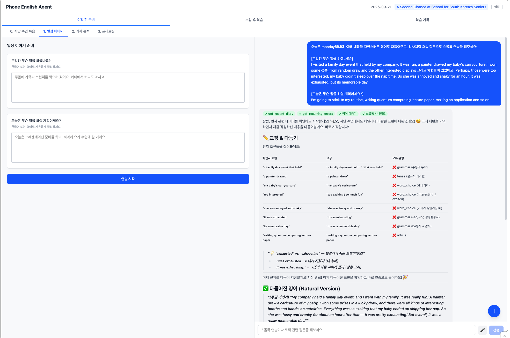
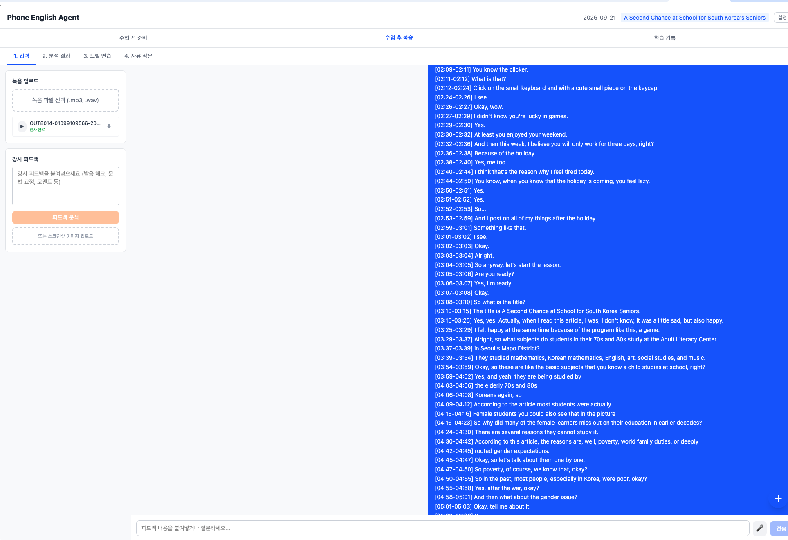
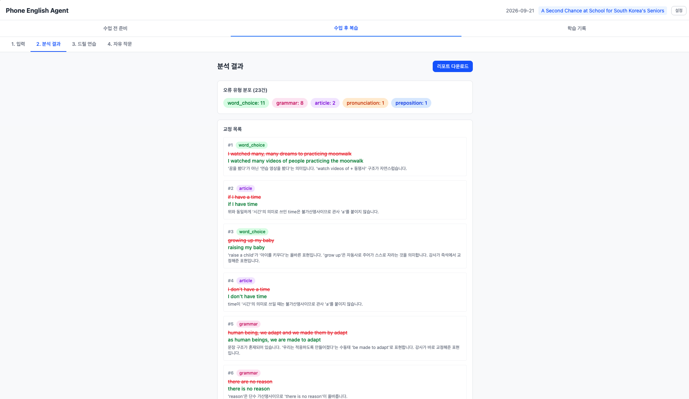
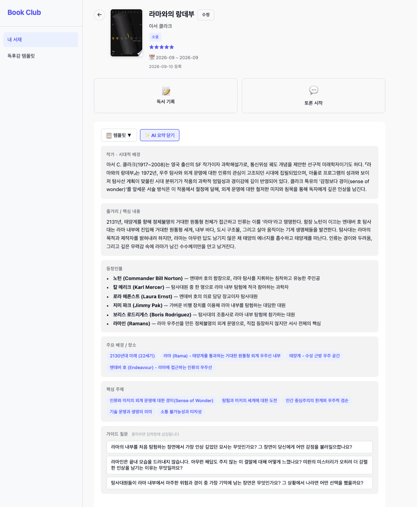
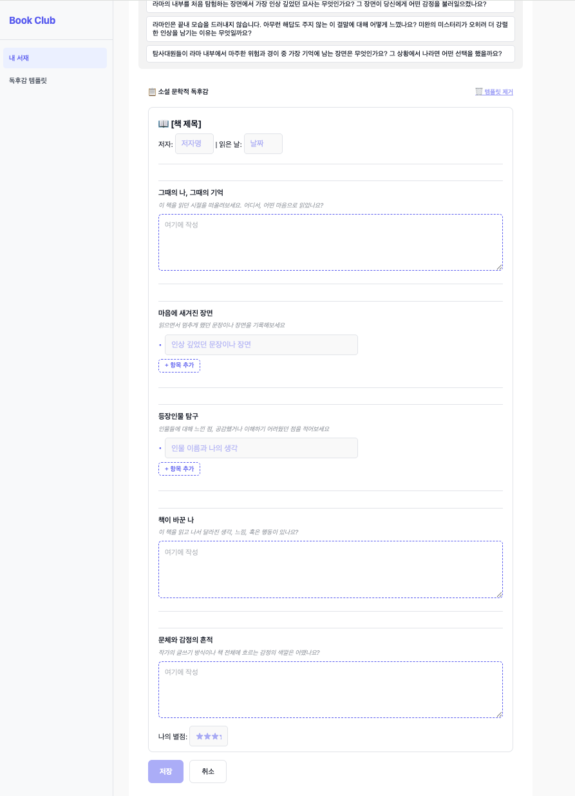
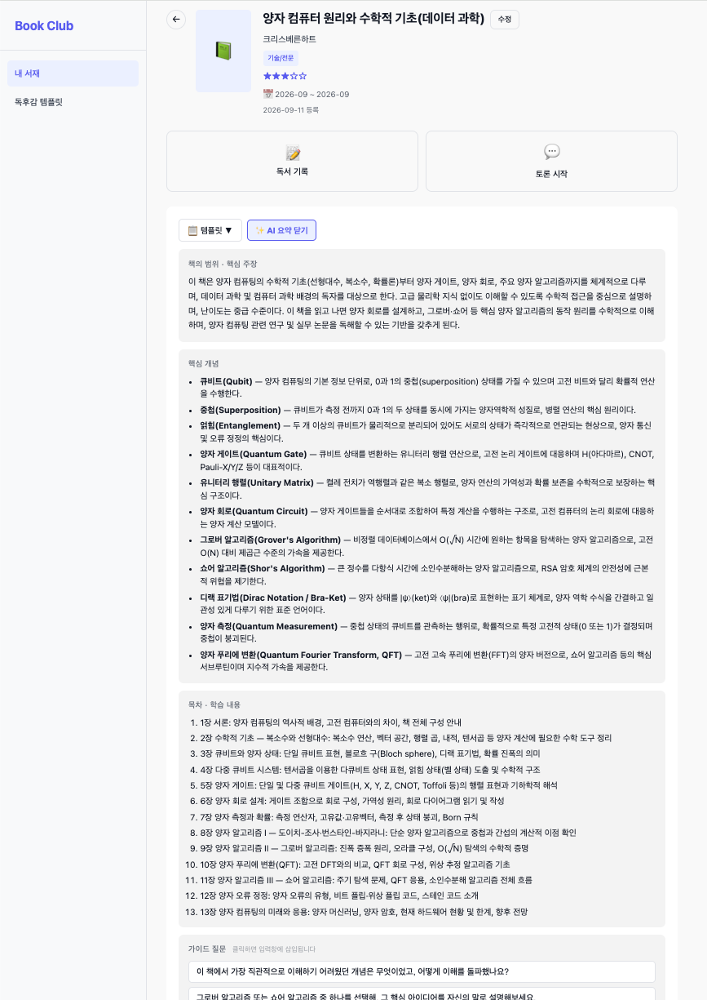
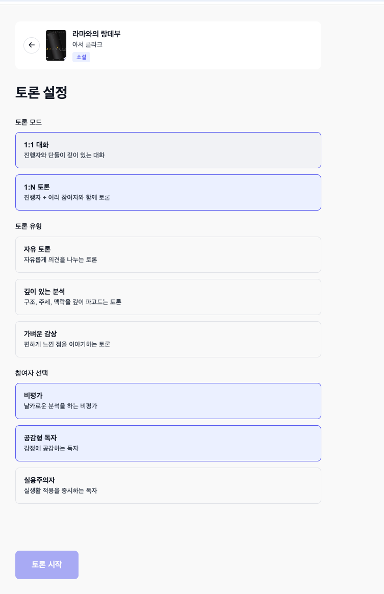
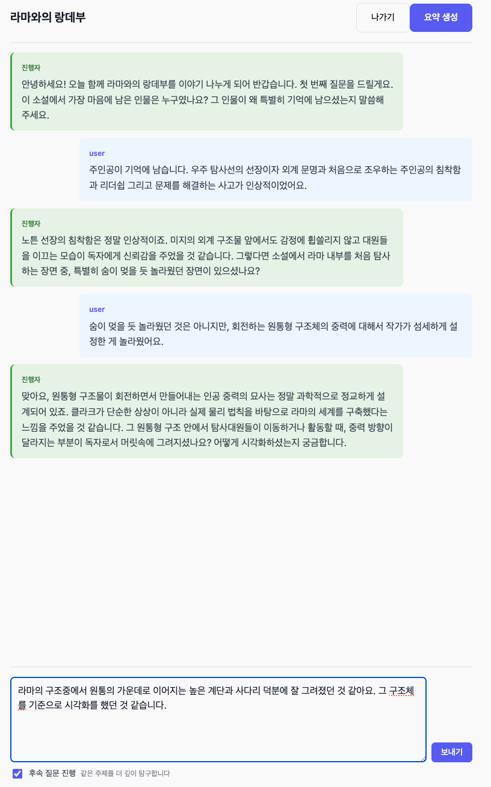
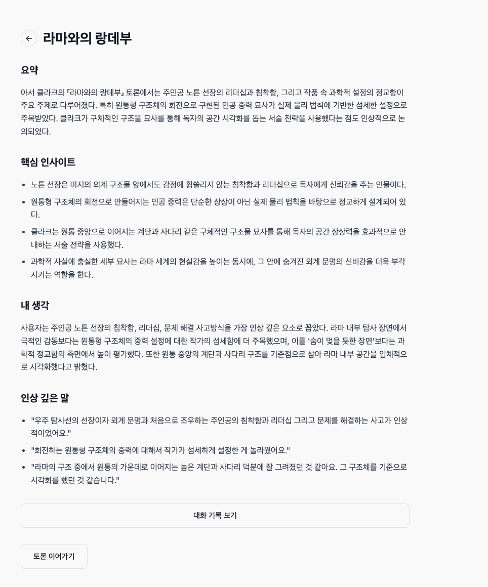

# 들어가며
- AI 광풍이 시작된지도 어언 몇년째, 바쁘다는 핑계로 미뤄오던 서비스 개발에 대한 열정이 갑자기 타올라 만들게 된 서비스들 중 내가 가장 잘 사용하는 두 서비스를 소개하고, 개발과정에서 겪은 경험과 교훈을 소개하고자 합니다.

# 목차 
1. 서비스 소개
2. 전화 영어 에이전트
3. Book Club
4. 종합

# 이 블로그 포스트 시리즈는 아래와 같은 내용을 포함하고 있습니다.
1. AI Agentic Service 에서 이용된 기술적 결정들, Agent 툴, 프롬포트, Workflow와 개선 Loop 그리고 아키텍처
2. AI Agentic Service 개발간 발생한 기술적 문제와 그 해결
3. AI Agentic Service 를 개발할 때 삽질을 덜 하는 법
4. 전화 영어를 하고 있다면, 어쩌면 도움이 될 오픈소스 서비스
5. AWS 기반의 AI 챗봇 서비스의 아키텍처 결정시 주의점

# 기대할 수 없는 내용들
1. AI로 서비스 자동 개발 공장을 만들어 돈 벌기 
2. 서비스를 성공적으로 런칭해서 돈 버는 성공기
3. 블로그를 보고 바로 AI 서비스를 만들 수 있는 비결
4. 상세한 코드와 상당이 깊은 기술적 고찰

# 블로그에서 소개되는 두 서비스들
## 전화 영어 에이전트 - [설치 가능한 프로젝트 링크](https://github.com/maxHyeon/phone-eng-agent-v2)
- 전화 영어 에이전트 서비스는 3~4년간 전화 영어를 하고 있음에도 영어를 잘 말하지 못하는 본인이 그 원인으로 생각한 두가지 1. 토픽에 대한 이야기를 하기 전 스몰톡을 강사와 하는데, 매번 생각을 안하고 수업을 진행해서 아무 일 없다는 똑같은 말만 함, 2. 수업 이후 제공되는 녹음 파일을 듣는게 너무 괴로워서 그냥 넘어가고 자주 틀리는 표현에 대한 교정이 없음 를 AI의 도움을 받아 해결하고자 개발 하였습니다. 
- 이 서비스는 사용자에게 다음과 같은 도움을 줍니다. 
1. 사용자가 작성한 수업 전에 겪은 일, 수업 이후에 할 일에 대한 내용을 보고 원어민이 쓰는 자연스러운 언어로 교정 해 줍니다. 
2. 원한다면, 작성한 내용을 바탕으로 음성, 채팅을 통해 지속적인 대화를 할 수 있습니다. 

3. 음성 녹음 파일, 강사 피드백 캡쳐를 업로드 하면, 음성과 이미지 분석을 통해 교정을 제공하고, 비슷한 유형의 연습문제를 통해 지속적인 실수를 교정 해 줍니다. 
4. 사용자의 데이터는 저장되고, 통계적으로 변환되어 이후 학습 때 AI 는 관련 컨텍스트를 기억하고 대화를 진행하며, 자주 틀리는 표현에 대한 주의를 제공합니다. 

- 클로드 혹은 AWS Bedrock 을 이용할 수 있는 경우 사용 가능한 서비스이며 5분 이내 설치 가능합니다. 
[프로젝트 깃헙](https://github.com/maxHyeon/phone-eng-agent-v2)

## 독서 토론 & 기록 서비스 : Book Club
- Book Club 은 책을 꽤 좋아하지만, 독서 토론이나 모임은 부담스러운 본인이 AI Agent 들과 함께 토론하면 좋지 않을까 ? 하는 아이디어 에서 시작 된 서비스입니다. 개발 도중, 책을 읽기는 하는데, 무슨 책을 읽었는지 잘 기억도 안나고, 기록해 두지 않는 문제의 해결에도 도움을 줄 수 있을것 같아 독서 기록 기능으로도 확장 되었습니다. 
- 이 서비스는 사용자에게 다음과 같은 도움을 제공합니다. 
1. 책의 카테고리별 특화된 AI 요약을 제공해 주어 독서 기록시 다양한 관점에서 다시 생각해 볼 수 있도록 합니다. 
2. 개인별 기록 템플릿을 통하여 책을 읽은 이후 나의 기록을 개인화 하여 기록할 수 있도록 합니다.

3. 비문학, 전문 서적의 경우 작가의 핵심 주장과 개념, 그리고 상세한 목차를 제공하여 얻은 지식을 확인할 수 있는 요약을 제공합니다.

4. AI 진행자와 1:1 혹은, 다양한 유형의 AI Agent 들과 1:N으로 책에 대한 토론을 진행할 수 있도록 합니다. 

5. 진행자는 토론회를 진행하며, Agent 들은 페르소나에 맞게 각자의 의견을 제시합니다. 또한 후속 질문 옵션을 통하여 조금 더 깊게 생각해 봐야 될 문제에 대해서 깊게 토론할 수 있습니다. 토론은 책의 카테고리에 따라 다르게 진행됩니다. 

6. 토론이 어느정도 끝났다고 생각되면 요약을 생성할 수 있으며, 이어서 계속 토론또한 가능합니다.

# 다음 시리즈
- 전화 영어 에이전트 서비스에 대한 AI workflow, loop, 프롬포트, tool, 아키텍처 소개 및 개발 과정에서의 교훈을 다룹니다. 

# 전화 영어 에이전트 
전화 영어 에이전트