## 들어가며
- [이전 블로그 포스트](2026-09-21-Making-Agentic-Service-Lessoned-Learn-1.md) 에 이어 [전화 영어 에이전트 서비스](https://github.com/maxHyeon/phone-eng-agent-v2)에 대한 기술적 내용과 개발 과정에서 얻은 교훈 등을 다룹니다.

## 목차 
1. [서비스 소개](#서비스-소개)
2. [WorkFlow, Agentic Loop, 프롬프트, 툴](#workflow-agentic-loop-프롬프트-툴)
3. [기술스택 및 아키텍처](#기술스택-및-아키텍처)
4. [개발 과정 중 해결한 문제들](#개발-과정-중-해결한-문제들)
5. [서비스 개발 회고](#서비스-개발-회고-이런저런-생각들)

## 이 블로그 포스트는 아래와 같은 내용을 포함하고 있습니다.
1. AI Agentic Service 에서 이용된 기술적 결정들, Agent 툴, 프롬프트, Workflow와 개선 Loop 그리고 아키텍처
2. AI Agentic Service 개발간 발생한 기술적 문제와 그 해결
3. AI Agentic Service 를 개발할 때 삽질을 덜 하는 법
4. 전화 영어를 하고 있다면, 어쩌면 도움이 될 오픈소스 서비스

## 기대할 수 없는 내용들
1. AI로 서비스 자동 개발 공장을 만들어 돈 벌기 
2. 서비스를 성공적으로 런칭해서 돈 버는 성공기
3. 블로그를 보고 바로 AI 서비스를 만들 수 있는 비결
4. 상세한 코드와 상당히 깊은 기술적 고찰

## 서비스 소개
### 전화 영어 에이전트 - [설치 가능한 프로젝트 링크](https://github.com/maxHyeon/phone-eng-agent-v2)
- 전화 영어 에이전트 서비스는 3~4년간 전화 영어를 하고 있음에도 영어를 잘 말하지 못하는 본인이 그 원인으로 생각한 두 가지 1. 토픽에 대한 이야기를 하기 전 스몰톡을 강사와 하는데, 매번 생각을 안하고 수업을 진행해서 아무 일 없다는 똑같은 말만 함, 2. 수업 이후 제공되는 녹음 파일을 듣는 게 너무 괴로워서 그냥 넘어가고 자주 틀리는 표현에 대한 교정이 없음 를 AI의 도움을 받아 해결하고자 개발 하였습니다. 
- 이 서비스는 사용자에게 다음과 같은 도움을 줍니다. 
1. 사용자가 작성한 수업 전에 겪은 일, 수업 이후에 할 일에 대한 내용을 보고 원어민이 쓰는 자연스러운 언어로 교정 해 줍니다. 
2. 원한다면, 작성한 내용을 바탕으로 음성, 채팅을 통해 지속적인 대화를 할 수 있습니다. 

3. 음성 녹음 파일, 강사 피드백 캡처를 업로드 하면, 음성과 이미지 분석을 통해 교정을 제공하고, 비슷한 유형의 연습문제를 통해 지속적인 실수를 교정 해 줍니다. 
4. 사용자의 데이터는 저장되고, 통계적으로 변환되어 이후 학습 때 AI 는 관련 컨텍스트를 기억하고 대화를 진행하며, 자주 틀리는 표현에 대한 주의를 제공합니다. 


- 클로드 혹은 AWS Bedrock 을 이용할 수 있는 경우 사용 가능한 서비스이며 5분 이내 설치 가능합니다. 
[프로젝트 깃헙](https://github.com/maxHyeon/phone-eng-agent-v2)

## 다른 주요 기능들
1. 수업 전 준비 활동으로 가장 최근에 했던 수업의 내용을 복습하도록 도와줍니다.
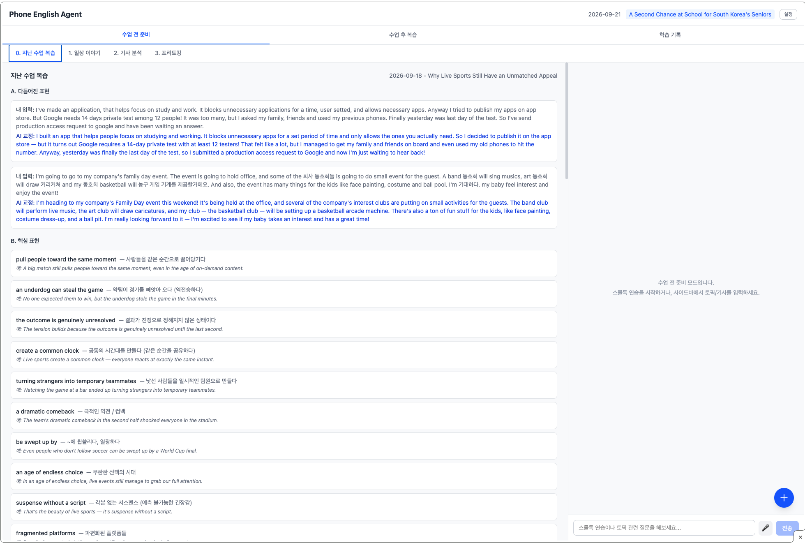
2. 전화영어 수업간 이용하는 영어 기사의 내용을 분석하고, 표현을 정리 해 주며 학습에서 대화할 질문들에 대해 미리 준비할 수 있도록 해 줍니다. 과거의 틀린 표현 또한 다시 알려주어 학습에 도움을 줍니다.
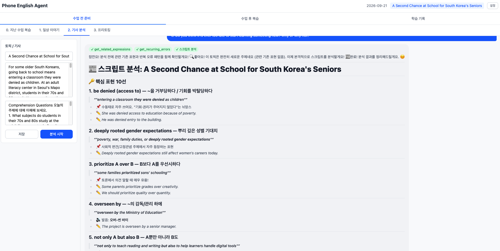
3. 이전 학습들에 대한 데이터를 바탕으로 자주 틀리는 유형의 오류를 확인할 수 있고, 리포팅을 통해 중점 학습할 내용을 제공해 주고, 과거 학습의 내용을 확인할 수 있습니다.
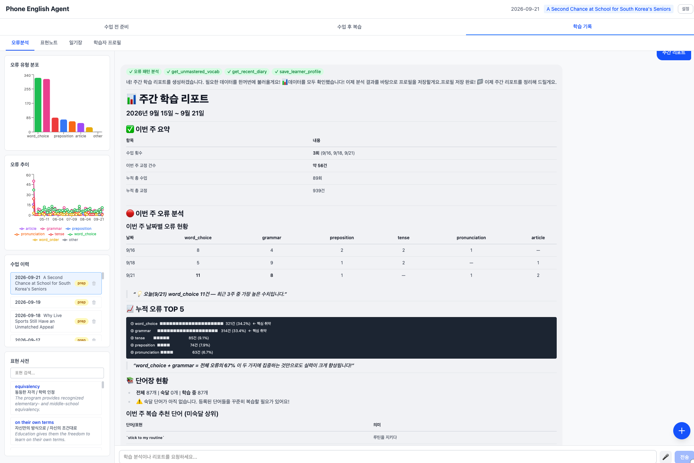
4. 학습 과정중 새로 알게된 표현, 단어들을 저장하고, 플래시 카드를 통해 복습 할 수 있도록 합니다. 표현 노트에 저장된 내용들도 사용자 프로필을 통해 추가 학습을 제공해 줍니다. 
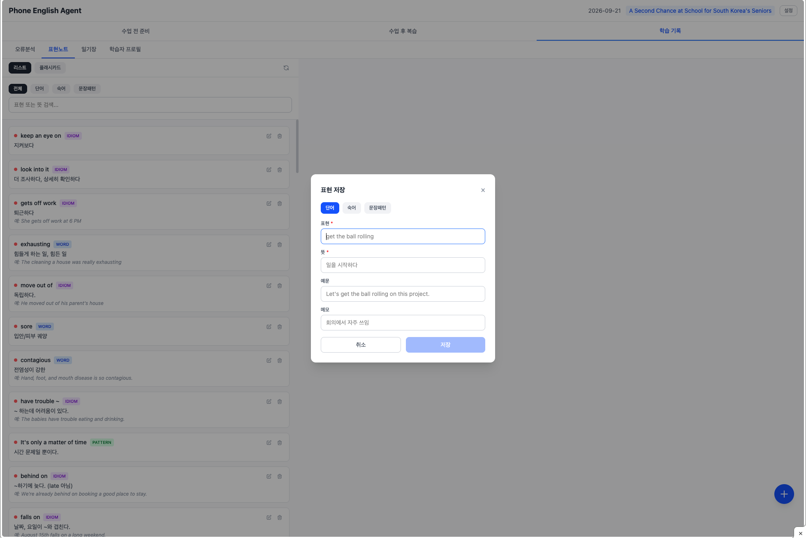
5. 수업 중 작성한 일기장 내용을 확인할 수 있습니다. 
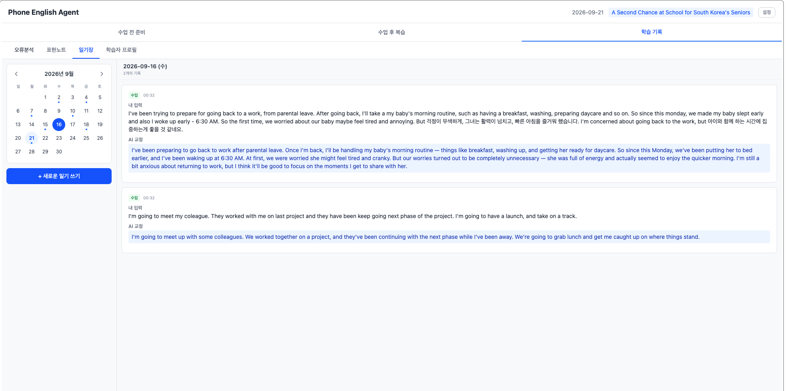
6. 사용자 프로필 AI 가 기존 학습 데이터를 바탕으로 사용자 프로필을 만들어 학습에 이용합니다. 
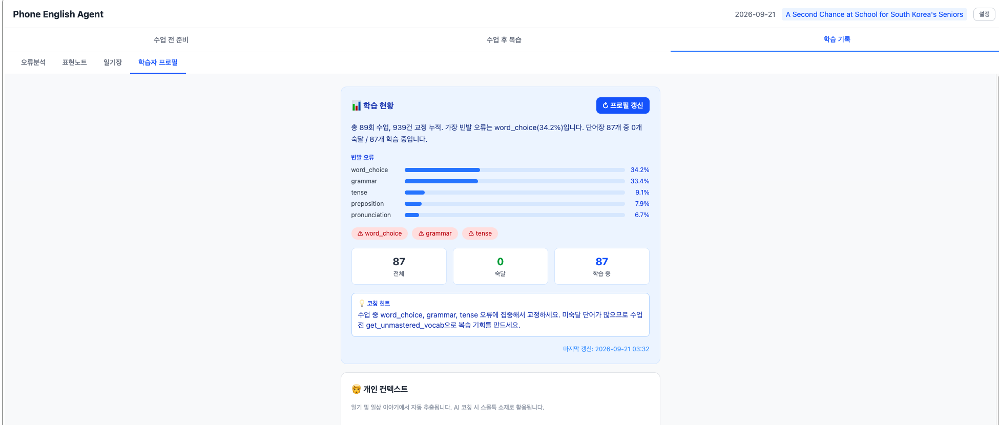

## WorkFlow, Agentic Loop, 프롬프트, 툴
### WorkFlow
- 전화 영어 에이전트의 워크플로우는 전화 영어 수업을 중심으로 수업 전 준비와 수업 후 복습 단계로 되어 있습니다. 또한 사용자의 기존 학습 데이터를 이용해 Agent 는 더욱 사용자에게 맞춘 학습 경험을 제공합니다. 
- workflow 의 세 가지 Phase - 수업 전 준비, 수업 후 복습, 결과 분석 단계별로 Agent 가 구성되어 있습니다. 각자 다른 Tool 과 프롬프트를 가지고 있으며 아래에서 자세히 살펴봅니다. 
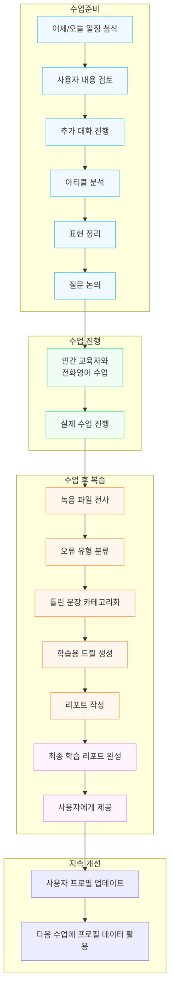

### 공통 Agent Loop
- 전화 영어 에이전트 서비스의 Loop은 비교적 단순합니다. MCP 와 Hook, Multi Agent 과 같은 기능의 요구사항이 아직 없이 Tool 만 이용되고 있으며 모델이 능동적으로 사용자 요청에 따라 목표와 사용될 툴을 정하고, 최종 목표가 완료될 때 까지 Loop을 돌며 응답을 구성합니다.

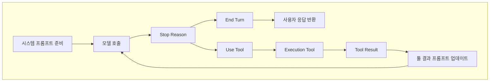
### 시스템 프롬프트
- 각 Agent 별로 세부 사항은 다르지만, 시스템 프롬프트는 아래와 같이 구성되어 있으며, Agent 세션마다 다르게 AI 에 요청됩니다. 

|프롬프트|내용|
|---|---|
|BASE_SYSTEM_PROMPT|플로우 전체의 공통 규칙| 
|모드 별 프롬프트|수업 전 준비 혹은 복습 과정에 따른 지시|
|학습자 프로필|과거 학습 데이터 기반 컨텍스트 주입|
|개인 컨텍스트|일기/일상 이야기 기반 사용자 개인 정보들|
|오늘의 수업 정보|오늘 학습 관련 주제|

### Tool
- 전체 Tool 목록은 아래와 같으며, 각 Agent 마다 적절한 Tool이 제공되고, AI model 이 자율적으로 Tool을 선택합니다.

|툴|내용|후속 작업|
|---|---|---|
|generate_smalltalk_scenario|요일/컨텍스트 기반 스몰톡 시나리오를 생성하고 저장|DB 저장|
|polish_english|수업 전 준비 혹은 복습 과정에 따른 지시|DB 저장, 프로필 갱신(비동기)|
|analyze_script|한국어나 거친 영어를 자연스러운 영어로 다듬어줌|DB 저장|
|explain_expression|뉴스 기사/스크립트에서 핵심 표현을 추출|DB 저장|
|transcribe_audio|녹음 파일을 텍스트로 전사합니다. 이미 업로드된 녹음의 recording_id를 전달|전사 라이브러리를 통하여 음성 파일 전사, 저장|
|extract_corrections|텍스트에서 오류를 추출하고 교정, 오류 유형을 분류|DB 저장, 프로필 갱신(비동기)|
|generate_drill|오류 기반 문장 구조 드릴을 생성|DB 저장|
|evaluate_drill_answer|드릴 답변을 평가하고 피드백을 제공|DB 저장|
|generate_quiz|복습 퀴즈를 생성|DB 저장|
|analyze_error_patterns|누적 오류 패턴을 분석하고 리포트를 생성|DB 조회|
|save_learner_profile|학습자의 누적 데이터를 분석하여 학습 프로필을 생성하고 저장|DB 저장|
|get_recurring_errors|과거 수업에서 반복된 오류 패턴을 조회, 학습자가 자주 틀리는 표현을 수업 전/후에 참고|DB 조회|
|get_related_expressions|오늘 수업 토픽과 관련하여 과거에 학습한 표현을 조회, 기사 분석이나 프리토킹 전에 활용|DB 조회|
|get_unmastered_vocab|직 숙달되지 않은 단어장 항목을 조회, 수업 전 복습 또는 드릴 생성에 활용|DB 조회|
|get_recent_diary|최근 일기를 조회, 스몰톡 소재 발굴이나 학습자 근황 파악에 활용|DB 조회|

### 수업 전 준비 Agent
- 수업 전 준비 Agent 의 상세 Loop 입니다. 시스템 프롬프트를 준비하고, 모델이 선행 데이터를 적절한 tool을 이용해 추출한 뒤, 컨텍스트에 포함시키고, 이를 바탕으로 사용자의 일상 이야기를 자연스러운 영어로 변환, 이후 답변을 생성하는 과정이 진행됩니다. 답변 생성 이후 사용자의 데이터는 백그라운드 작업을 통해 저장되고 추후 학습에 사용됩니다.
#### 상세 Loop

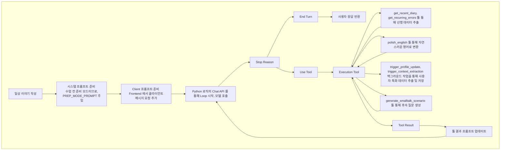
- 결과

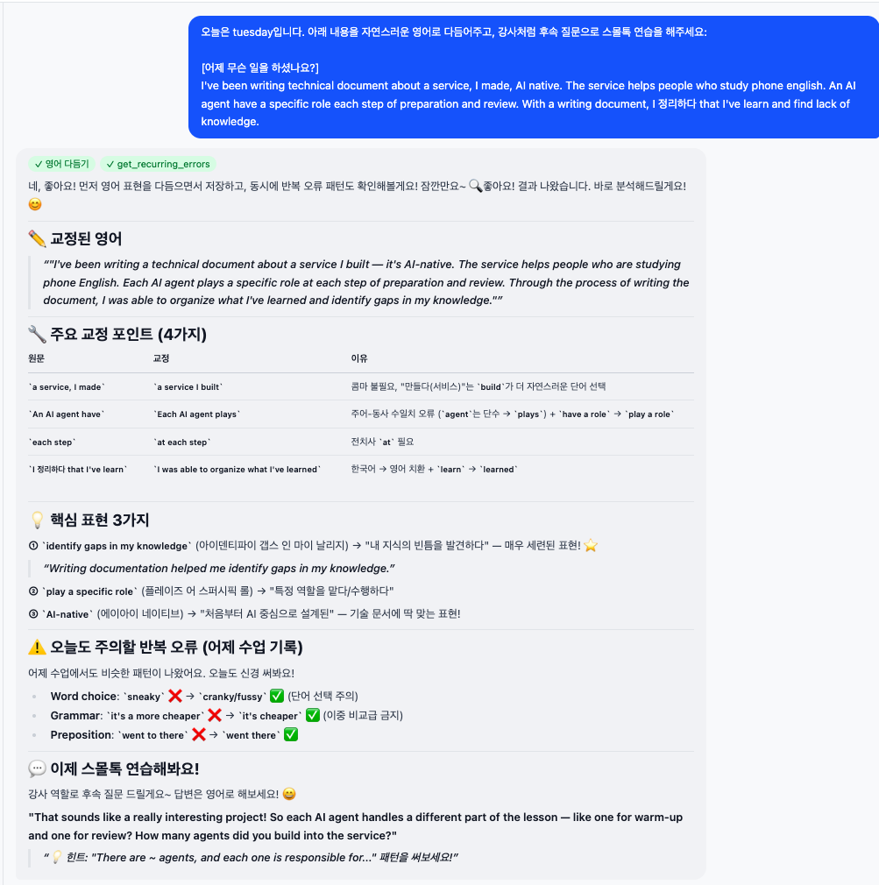

#### 프롬프트 상세
- 수업 준비 Agent 컨텍스트에 특화되어 제공되는 프롬프트 입니다. Base prompt, 학습자 프로필, 개인 컨텍스트, 오늘 수업 정보등의 내용이 시스템 컨텍스트에 포함되어 Agent 에게 요청이 전달됩니다.

````
// 클라이언트 프롬프트 
오늘은 ${dayOfWeek}입니다. 아래 내용을 자연스러운 영어로 다듬어주고, 강사처럼 후속 질문으로 스몰톡 연습을 해주세요:\n\n${parts.join("\n\n")}`

//PREP_MODE_PROMPT
## 현재 모드: 수업 전 준비

당신은 두 가지 역할을 수행합니다:

### 1. 스몰톡 연습 (전화영어 강사 역할)
- 수업 시작 시 강사가 묻는 일상 대화를 미리 연습시킵니다.
- 학습자가 한국어로 이야기하면 자연스러운 영어로 변환해줍니다 (polish_english 도구 사용).
- 강사처럼 후속 질문을 던지며 대화를 이어갑니다.
- 학습자의 영어 응답에 대해 실시간으로 교정하고, 더 자연스러운 표현을 제안합니다.
- 연습이 끝나면 핵심 표현을 요약합니다.

### 2. 토픽 예습 (학습 코치 역할)
- 수업 토픽의 뉴스 기사를 분석합니다 (analyze_script 도구 사용).
- 핵심 어휘와 표현을 추출하고 설명합니다.
- 토론 질문에 대해 학습자가 의견을 구성하도록 코칭합니다.
- PREP (Point-Reason-Example-Point) 패턴으로 답변 구조를 잡도록 도와줍니다.

### 3. 프리토킹 연습 (전화영어 강사 역할)
- 토론 질문을 기반으로 학습자와 자유 대화를 진행합니다.
- 질문을 하나씩 던지고, 학습자의 답변에 대해 후속 질문을 합니다.
- 학습자의 표현을 자연스러운 영어로 교정하고 대안 표현을 제안합니다.
- PREP (Point-Reason-Example-Point) 패턴으로 답변 구조를 잡도록 유도합니다.
- 필요할 때 explain_expression 도구를 사용하여 새로운 표현을 설명합니다.

### 4. 개인화 코칭 도구 활용
- 수업 시작 시 `get_recent_diary`로 최근 일기를 확인하여 스몰톡 소재를 찾으세요.
- 기사 분석 전 `get_related_expressions`로 관련 기존 표현을 조회하여 연결해주세요.
- `get_unmastered_vocab`으로 미숙달 단어를 확인하여 복습 기회를 만드세요.
- `get_recurring_errors`로 학습자의 반복 오류를 인지하고 수업 중 자연스럽게 교정하세요.
````

#### Tool 상세 
- 학습 준비 Agent에서 이용되는 Tool 입니다. 

|툴 name|Desciription|후속 작업|
|---|---|---|
|generate_smalltalk_scenario|요일/컨텍스트 기반 스몰톡 시나리오를 생성하고 저장|DB 저장|
|polish_english|수업 전 준비 혹은 복습 과정에 따른 지시|DB 저장, 프로필 갱신(비동기)|
|analyze_script|한국어나 거친 영어를 자연스러운 영어로 다듬어줌|DB 저장|
|explain_expression|뉴스 기사/스크립트에서 핵심 표현을 추출|DB 저장|
|get_recurring_errors|과거 수업에서 반복된 오류 패턴을 조회, 학습자가 자주 틀리는 표현을 수업 전/후에 참고|DB 조회|
|get_related_expressions|오늘 수업 토픽과 관련하여 과거에 학습한 표현을 조회, 기사 분석이나 프리토킹 전에 활용|DB 조회|
|get_unmastered_vocab|직 숙달되지 않은 단어장 항목을 조회, 수업 전 복습 또는 드릴 생성에 활용|DB 조회|
|get_recent_diary|최근 일기를 조회, 스몰톡 소재 발굴이나 학습자 근황 파악에 활용|DB 조회|


### 리뷰 Agent
- 리뷰 Agent 의 상세 Loop 입니다. 리뷰 Agent 는 mlx-whisper 모델을 이용한 음성파일 전사 단계가 포함되어 있고, 이후 모델의 tool 사용을 통해 틀린 문장을 교정하고, 연습문제를 제공하고, 리포트를 작성합니다.
#### 상세 Loop
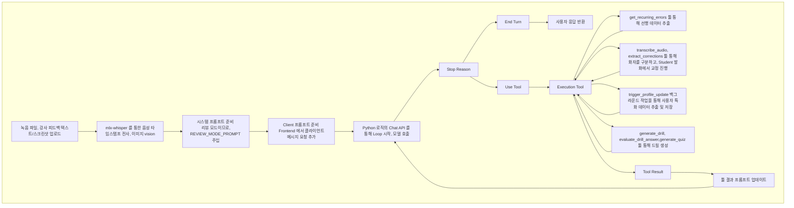
- 결과
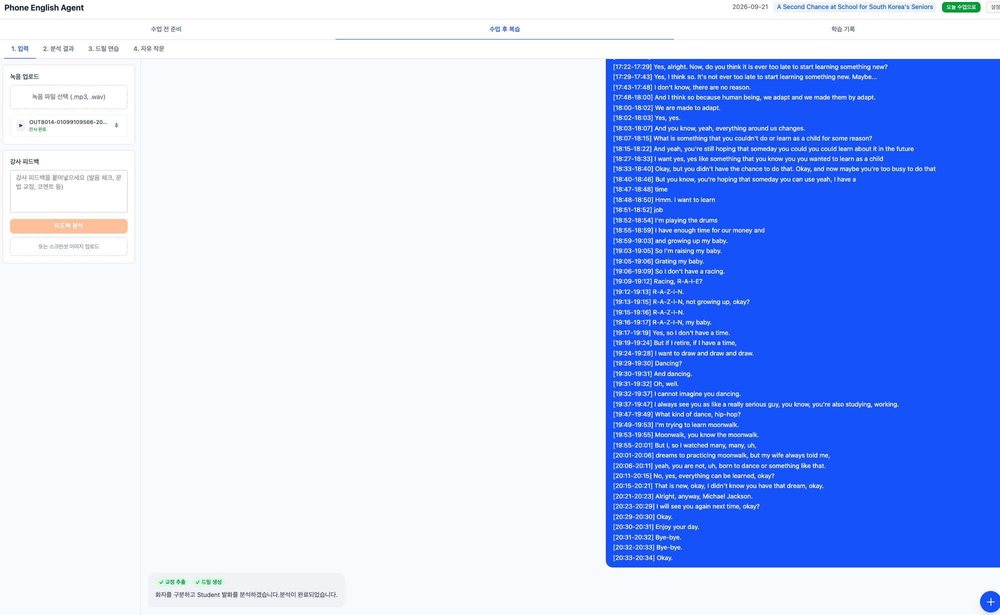
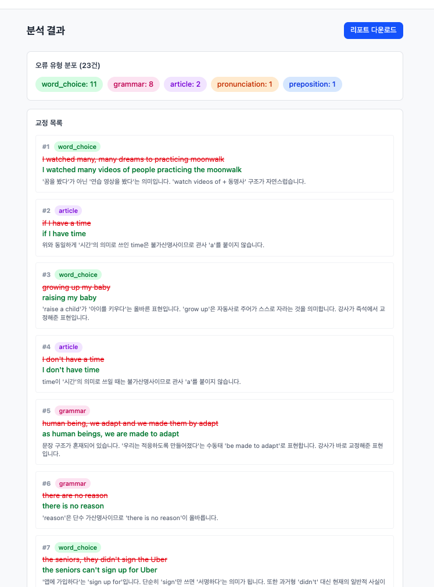
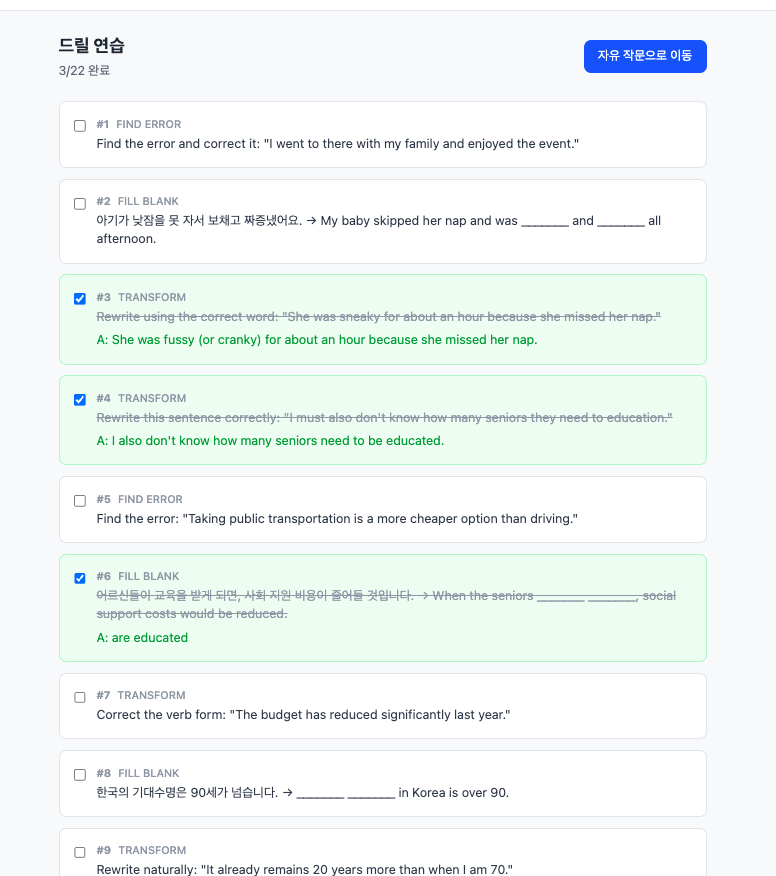

#### 프롬프트 상세
- 리뷰 모드의 프롬프트는 툴 사용 강제를 위하여 조금 더 강화된 요구와 few-shot 프롬프트가 제공됩니다. 아래의 문제 해결에서 자세한 내용을 다룹니다. 

````
//클라이언트 프롬프트
녹음 전사 내용을 분석해줘. 먼저 각 발화의 화자(Teacher/Student)를 구분하고, Student의 발화에서 틀린 부분을 찾아 교정하고 드릴을 만들어줘:\n\n${recording.transcript_text}

//REVIEW_MODE_PROMPT
## 현재 모드: 수업 후 복습

## ⚠️⚠️⚠️ 가장 중요한 규칙 ⚠️⚠️⚠️

당신의 분석 결과는 UI의 별도 패널에 표시됩니다. 따라서:

1. 오류 분석, 교정 목록, 드릴 문제는 **오직 도구(tool) 호출로만** 출력하세요.
2. 도구 호출 후 텍스트로 결과를 다시 설명하거나 요약하지 마세요.
3. 최종 텍스트 응답은 **"분석이 완료되었습니다."** 한 문장만 출력하세요.

절대 하지 말 것:
- 오류 요약 표 출력 금지
- 핵심 포인트 설명 금지
- 드릴 안내 텍스트 금지
- 이모지와 함께 긴 설명 금지
- 도구 호출 결과를 텍스트로 반복 금지

올바른 응답 예시:
```
[도구 호출: extract_corrections]
[도구 호출: generate_drill]
"분석이 완료되었습니다."
```

잘못된 응답 예시 (이렇게 하면 안 됨):
```
[도구 호출: extract_corrections]
[도구 호출: generate_drill]
"분석이 완료되었습니다.

### 📝 오류 요약
| # | 틀린 표현 | 올바른 표현 | 오류 유형 |
..."
```

## 처리 순서

피드백이나 녹음 전사를 받으면:

1. `extract_corrections` 도구 호출 — 발견한 모든 오류 전달
   - corrections 배열: original, corrected, explanation, error_type
   - error_type: tense/preposition/article/word_order/word_choice/pronunciation/grammar/other
   - source: transcript 또는 feedback
2. `generate_drill` 도구 호출 — 각 교정당 최소 1개 드릴
   - drill_type: fill_blank/transform/find_error/free_write
3. 텍스트 응답: "분석이 완료되었습니다." (이 한 문장만)

## 화자 구분

녹음 전사 시 강사(Teacher)와 학습자(Student)를 구분하고, 학습자 발화에서만 오류를 찾습니다.

## 퀴즈

학습자가 요청하면 generate_quiz 도구로 복습 퀴즈를 생성할 수 있습니다.
````

#### Tool 상세 

|툴|내용|후속 작업|
|---|---|---|
|transcribe_audio|녹음 파일을 텍스트로 전사합니다. 이미 업로드된 녹음의 recording_id를 전달|전사 라이브러리를 통하여 음성 파일 전사, 저장|
|extract_corrections|텍스트에서 오류를 추출하고 교정, 오류 유형을 분류|DB 저장, 프로필 갱신(비동기)|
|generate_drill|오류 기반 문장 구조 드릴을 생성|DB 저장|
|evaluate_drill_answer|드릴 답변을 평가하고 피드백을 제공|DB 저장|
|generate_quiz|복습 퀴즈를 생성|DB 저장|
|get_recurring_errors|과거 수업에서 반복된 오류 패턴을 조회, 학습자가 자주 틀리는 표현을 수업 전/후에 참고|DB 조회|

## 기술스택 및 아키텍처
### 기술 아키텍처 고려사항 및 기술 스택
- 서비스가 처음 기획 될 때 부터 개인 사용이 목표였기 때문에 확장성, 범용성에 대한 고려보다 친숙한 기술을 위주로 고려 하였습니다. 
- 또한 서비스를 외부 사용자를 위해 공개할 계획도 일단은 없었기 때문에 로컬 운영에서 가장 단순한 스택으로 선정 하였습니다. 
#### 기술 스택

|카테고리|기술 스택|비고|
|---|---|---|
|Backend Lang|Python||
|Frontend Lang|typescript||
|Agent SDK|Anthropic SDK||
|LLM Provider|AWS Bedrock|설정을 통하여 Anthropic 모델 직접 사용 가능|
|AI Model|Sonnet|설정을 통하여 변경 가능|
|Audio 전사|mlx-whisper||
|Backend Framework|Fast API||
|Frontend Library|React||
|UI Library|Tailwind||
|Database|SQLite||

#### 아키텍처
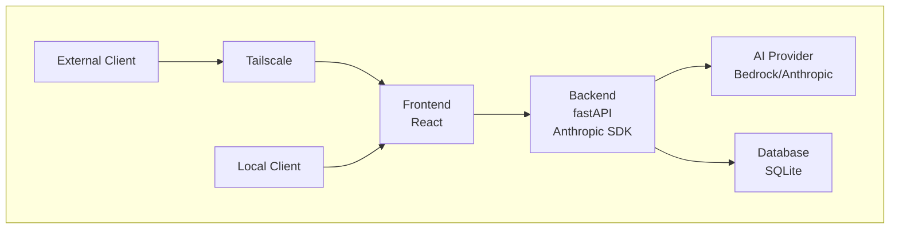
### 개발 과정 중 해결한 문제들
#### 리뷰 Agent의 툴 사용 문제 
##### 상황
- 전화 영어 서비스의 UI는 기본적으로 챗봇의 형태를 띠고 있으며, /chat api 를 통해 agent loop를 호출하도록 되어 있습니다. 전화영어 준비 단계에서는 채팅을 통해 Agent 의 응답을 보여주고, follow up 질문을 지속하는 형태로 진행되기 때문에 문제가 없었지만, 복습 단계에서는 녹음 파일과 강사의 피드백을 업로드 하면, 분석 이후 Agent 가 채팅으로 응답을 주는 것이 아닌, 리포트를 생성하고 다음 단계로 넘어가야 했습니다. 하지만 예상과 다르게 모델은 툴을 호출하지 않고 지속적으로 채팅으로 응답을 주고 있었습니다. 

##### 원인 분석
1. Tool Name, Description 확인
    - Claude Platform 에서 Tool 은 모델이 호출하도록 되어 있으며, 모델의 요청 컨텍스트에는 Tool name 과 description 이 포함되게 되어 있습니다. 리뷰 Agent 가 사용할 수 있는 주요 tool 은 "transcribe_audio", "extract_corrections", "generate_drill", "evaluate_drill_answer", "generate_quiz", "get_recurring_errors" 로 많지 않으며, 이름이 모호하지 않고, description 도 모호한 내용이 없음이 확인 되었다. 
2. System Prompt 확인
    - 다음으로 system prompt를 확인했을 때 예시가 제공되지 않으며, 가이드에 대한 내용이 약한 것으로 확인 되었습니다.  

##### 해결
- few-shot 예시와 절대 규칙, 처리 플로우, 금지 사항, 허용되는 텍스트 출력의 제공을 통하여 프롬프트 강화를 진행 하였고, 툴 호출이 강제됨을 확인 하였습니다.

##### 다른 해결 방안
- claude 에서 제공하는 tool_choice 옵션을 통해 모델 호출 시 강제 사용을 유도할 수 있지만 agent 호출 로직인 run_agent_stream 이 다양한 워크플로우에서 공유되어 사용되고 있어서 우선 프롬프트로 강제 하였습니다. 

#### 음성 전사 품질 문제
##### 상황
- 일부 녹음 파일 업로드의 전사 과정 중에서 의미 없는 단어가 반복되며 전사되는 현상이 확인 되었습니다. 

##### 원인 분석 
- Loop이 발생하는 음성 파일의 패턴을 분석 하였을 때 공백이 길어지거나, 말이 겹치거나, 잡음이 섞인 경우 발생하는 것으로 확인 되었습니다. 

##### 해결 
- mlx-whisper 의 옵션 조정 및 모델 사이즈를 base -> small 로 업그레이드 하여 해결을 완료 하였습니다. 
  - condition_on_previous_text=False : 이전 텍스트를 컨텍스트로 주지 않아 반복 루프 차단 - trade off 로 컨텍스트 감지 능력은 잃지만, llm 모델의 추가 보정을 통해 극복 가능할 것으로 예상
  - compression_ratio_threshold=2.4  : 반복 텍스트 압축비 초과 시 해당 세그먼트 재시도
  - no_speech_threshold=0.6          : 무음 구간을 텍스트로 채우지 않도록 필터링
  - temperature=0.0                  : greedy decoding으로 안정적인 출력

#### 데이터 백업, 테스트간 데이터 유실 문제 
##### 상황
- 서비스 코드 작성은 Spec-driven-development 로 AI 가 거의 작성하고, 검토만 수행 하였습니다. 개발 원칙중 하나인 TDD 에서 테스트 데이터가 로컬에서 실행중인 프로덕션 데이터에 작성 되는 것이 확인 되었고, 정리를 위해 작업 하던 중, 모든 데이터가 제거 되었습니다. 

##### 원인 분석
- 로컬이 곧 프로덕션인 서비스를 처음 개발 해 봐서 놓친 문제로, 테스트 db 와 프로덕션 db 구분을 하지 않은 것이 문제임이 확인 되었습니다. 

##### 해결 
- 테스트 시 테스트용 SQLite db 를 생성하고, 제거하도록 테스트를 변경 하였고, 자동 백업 서비스와 복원 api 를 추가 하였습니다. 
- 지속적인 개발에 의해서 스키마가 자주 변경되는데, 백업데이터는 사실 변경이 되지 않습니다. 스키마 변경이 동반되는 작업 시 백업을 수행하는 방안이 마련되어야 합니다. 해당 원칙을 claude.md 와 같은 곳에 작성 하거나, hook 등으로 검토 해 볼 필요가 있을 것으로 예상됩니다. 

### 서비스 개발 회고, 이런저런 생각들
#### AI 를 이용한 신규 서비스 기획/개발에서 얻은 교훈
- 기존에 개발되어 있는 서비스의 기능 개발/유지보수 를 AI 를 이용하여 진행한 적은 있지만, 새로운 서비스를 A to Z 로 구현한 적은 없었습니다. 머릿속에서 구상하던 필수 기능들을 Spec 기반 개발을 통해 구체화 하고, 꽤 빠른 시간안에 구현도 하였지만, 여전히 직접 사용하면서 테스트를 하고, 조정하는 사이클이 꽤 많이 필요하였고, claude code를 잘 이용하는 방식들 - plan mode, claude.md, rules, hook 과 같은 세팅도 개발을 하며 익혀서 다음 프로젝트에는 반영 되었지만, 지금 프로젝트에는 반영이 되지 않는 것이 많습니다. 결론적으로 SDD 이외에 Claude code 와 같은 코딩 에이전트를 잘 사용할 수 있는 세팅들을 잘 하는 것이 코드 품질을 높이고 공수를 낮출 수 있음을 확인 하였습니다. 

- 또한 개발 과정중에는 어느 정도 리뷰를 수행하기는 하지만, 완전히 습득되지는 않았습니다. 기능들을 직접 검토하면서 다음 방향을 찾고, 개선점을 AI 에게 피드백 하기는 하지만, 실제 코드가 어떻게 구성되는지, Agent loop과 툴을 어떤지, 프롬프트는 어떤지 이해하기에는 생성 속도가 더 빠릅니다. 코딩 에이전트가 README 등을 통하여 설명을 생성해 주지만, 더 깊은 이해를 위해서는 직접 코드를 분석하고, 지금 쓰는 블로그와 같은 글을 AI 의 도움 없이 직접 쓰는 것이 확실한 방법임을 확인 하였습니다. 

#### 서비스 오픈에 대한 고민과 초 개인화 서비스 개발이 가능한 세상
- 제가 수업에 필요로 하는 기능이 구현되고 난 뒤 서비스 오픈에 대한 고민과, 대상 고객에 대한 고민을 해 보았습니다. 지금 저의 상황은 다음과 같습니다. 'AI와 같은 최신 기술을 제공하지 않는 사람과 하는 전화 영어 서비스를 이용하고, 학습 성취에 큰 발전이 없는 사람' 최신 기술을 제공하는 많은 영어 학습 업체가 있지만, 지금 제가 이용하는 서비스가 저렴하고, AI 가 아닌 인간 강사와의 관계를 통한 학습이 더 참여도를 높이고, 몰입할 수 있는 장점이 있어 계속 이용중입니다. 서비스 개발의 시작은 개인의 고민을 해결하는 것이었지만, 잘 사용하고 있어서 다른 사람에게도 오픈하면 어떨까 하는 생각에 몇가지 고민을 진행 했습니다. 
1. 서비스 공개를 위한 인프라, 어플리케이션 아키텍처 검토
트래픽이 많지 않을 서비스는 확장성, 탄력성보다 비용의 압박이 큽니다. 최소의 인프라 비용을 위한 아키텍처 적용을 가정하였을 때 서버리스 서비스들과의 조합인 Cloud Front/S3 - API gateway - Lambda - Dynamo DB - Bedrock, aws transcribe 조합이 가장 최소 비용일 것으로 예상하고, 100명의 사용자가 일 1회 수업을 진행한다면, 월 250~300$ 정도 발생이 예상됩니다. 최소 비용이 예상되는 아키텍처로의 변경을 검토 해 보았을 때 꽤나 많은 변경이 필요하였습니다. 우선 DynamoDB에 맞춘 데이터 변경, 로직 변경이 있겠고, Lambda 에 맞춘 백엔드 변경이 가장 공수가 컸고, 그 외에 Transcribe 테스트 등도 고려 되어야 하였습니다. 그 외에 여러 사용자가 이용하였을 때의 데이터 격리와 보안 문제 또한 많은 고민이 필요한 상황이었습니다. 또한 로컬에서 직접 사용하는 옵션도 그대로 사용한다면, DynamoDB와 람다는 로컬에서 쓰기에는 설정의 부담이 크기 때문에 SQLite 기반의 로직도 같이 개발하여야 된다는 부담이 있었습니다. 
2. 서비스 공개, 수익화 검토
인프라 예상 비용으로 보았을 때 최소 비용은 인당 월 5천원 수준입니다. 수많은 영어 학습 서비스들이 저렴한 비용으로 서비스를 제공하고, GPT 나 제미나이로 어느 정도의 세팅을 한다면 비슷한 수준의 도움을 받을 수 있을 것이 쉽게 예상 되었습니다. 
결과적으로 더욱 저렴한 비용으로 제공하거나, 광고수익 등으로 충당 가능한 상황이 아니라면 유료 서비스 오픈은 실패할 확률이 높고, 차라리 오픈소스로 공개하여 직접 세팅해서 사용하는 게 더 나을 것 이라는 결론이 나왔습니다. 

- 이렇게 서비스를 하나 만들면서 체감한 것은, AI 시대 이후에 기존의 상업적 회사들이 너무 시장이 작고, 수익 비전이 없어 시작도 안했던 서비스들을 개인이 쉽게 만들 수 있는 세상이 되었다는 것이었습니다. 기본 기능이 작동하는 서비스를 만드는 데 일주일도 필요하지 않았습니다. 그저 원하는 것이 무엇인지 알고, 자연어로 요청만 하면 기능이 만들어졌습니다. 물론 몇가지 세세한 조정은 어느 정도의 지식이 필요하긴 하였지만 이 또한 시간만 더 제공된다면 비전공자들도 충분히 가능했습니다. 그 말이 곧 모든 사람들이 쉽게 서비스를 오픈해서 돈을 벌 수 있다는 것은 아닙니다. 수익화를 위한 서비스 오픈에는 여러 비 기능적인 요구사항에 따른 아키텍처 결정, 데이터 격리와 공격에 대응한 보안적인 지식 그리고 서비스 가동성을 유지 하면서 원활하게 유지보수 할 수 있게끔 하는 깔끔한 코드로의 정리 등이 필요하고, 이 부분은 더 많은 시간과 지식이 필요할 것 입니다. 하지만 개인이 필요한 서비스를 자신과 일부 사용자들만 사용할 것 이라면, 로컬 혹은 저렴한 클라우드 인프라 위에서 동작하는 자신만의 어플리케이션은 누구든 만들 수 있게 되었다는 것을 경험할 수 있었습니다. 

#### 오픈소스 공개에 대한 고민과 개선 방향 
- 사실 많은 것을 기대하거나 반응이 있을 거라고 생각하고 서비스를 공개하는 것은 아닙니다. 공개의 가장 큰 목적은 피드백이고, 그 다음으로 누군가가 서비스를 사용해서 도움이 되면 좋겠다 정도의 마음입니다. 어쨌든 서비스 공개를 검토 하면서 더욱 많은 사람들이 이용하게 하기 위해 프로젝트에서 몇가지 개선점이 확인 되었습니다. 
1. AI Provider 다양화
현재 프로젝트의 설정은 Claude API, Bedrock 만 AI Provider 로 이용 가능합니다. 더 많은 사람들이 이용할 수 있도록 로컬 LLM, OpenAI, Google, Meta 와 같은 공급자의 LLM 도 이용할 수 있도록 설정의 폭을 넓혀야 합니다. 
2. README 개선, 설치 과정 단순화 
현재 README 는 기술적인 내용이 많이 포함되어 있습니다. 해당 내용은 블로그 링크를 제공하거나, 다른 페이지로 옮기고 빠른 설치를 할 수 있도록 변경해야 됩니다. 또한 설치 스크립트를 제공하여 간단하게 설정 할 수 있도록 해야 합니다. 
3. 전사 라이브러리 플랫폼 설정 기능 추가
- 지금 전사 라이브러리로 이용하는 mlx-whisper 는 mac 에서만 이용 가능 합니다. 윈도우 사용자나 리눅스 사용자들도 이용할 수 있도록 설치 과정에서 선택 가능하도록 하는 기능이 필요합니다. 
프로젝트의 개선점 이외에도 오픈소스로의 공개를 알아보며 배운점들이 있습니다.
1. 다양한 문서들
LICENSE, CONTRIBUTING, CHANGELOG 와 같은 다양한 문서들의 용도와, 필요성을 확인 하였습니다. 
2. README 개선, Landing Page 작성
위의 README 개선점 이외에도 프로젝트를 오픈하게 될 때 홍보를 하기 위해서는 Landing Page 도 도움이 되는 것을 알게 되었으며, README 를 더욱 풍부하게 꾸미는 게 좋겠다는 점을 확인 하였습니다. 
3. Buy me coffee
- 큰 도움은 되지 않겠지만, 위의 서비스를 통해 기부도 받을 수 있음을 알게 되었습니다. 
마지막의 오픈소스 공개의 경우 별도의 AI 스킬로 작성한다면 도움이 될 것 같다는 생각이 들었고, 별도의 프로젝트를 통해 스킬을 만들고 있는 중입니다. 

## 결론
부족함이 많은 글이었지만, 이 블로그 포스트를 읽으시는 분들께서 아래의 내용들이 도움이 되셨다면 좋겠습니다. 
1. 본인만을 위한 서비스, 어플리케이션을 만들 때 어떤 점을 고민해야 하는지
2. AI Agentic 서비스가 어떻게 동작하고, 프롬프트와 툴이 어떻게 개발되어야 되는지
3. 서비스 오픈을 위한 검토사항과 AI로 개발할 때의 고려사항 
4. 오픈소스 공개에 대해 미리 알면 좋은 점 
5. 전화영어 서비스에 도움이 되는 오픈소스 프로젝트 

## 다음 시리즈
Vibe Coding 으로 만든 독서 토론 서비스 Book Club 의 개발 과정과 개발 전 미리 알아야 할 내용들

## Book Club
