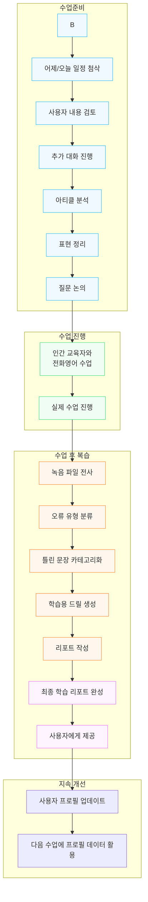
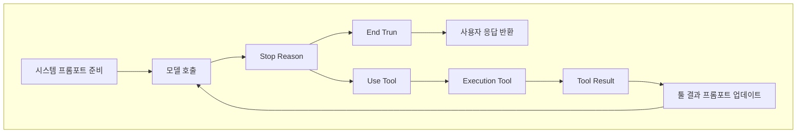
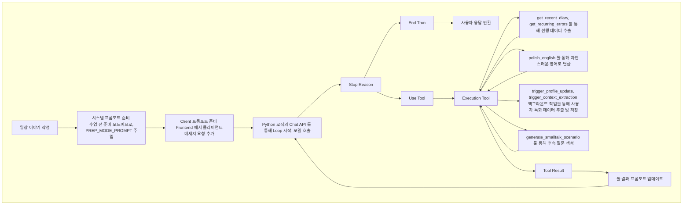
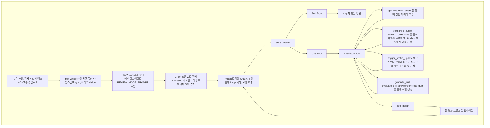
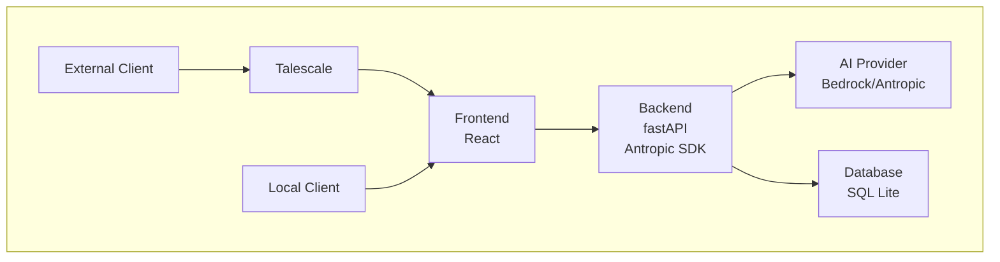
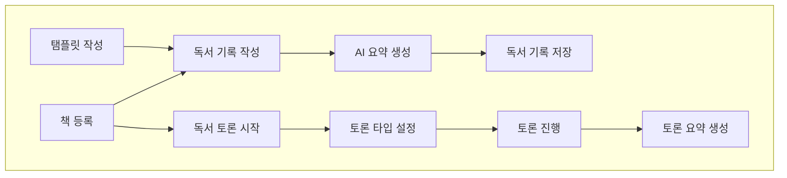
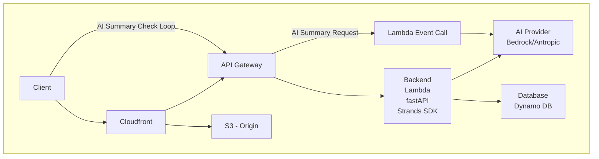

# 개요
- 두 AI Agentic 서비스 - 전화 영어 도우미, 독서 기록 & 토론 에이전트 서비스를 개발하고 사용 하면서 알게 된 내용과 해결한 내용을 되돌아 보며 나의 성장과 더 나아갈 방향을 고찰하고자 한다. 

# 목차 
1. 각 서비스에 대한 소개
2. 각 서비스의 Agentic Loop, Tool, 프롬포트, 기술 스텍 그리고 아키텍처
3. 각 서비스를 개발하며 해결한 문제들
4. 두 에이전트 서비스의 공통점과 차이점 그리고 메커니즘
5. 더 공부해 볼 내용들

# 각 서비스에 대한 소개
## 전화 영어 도우미 
### 소개
- 전화 영어 도우미 서비스는 3~4년간 전화 영어를 하고 있음에도 뚜렷한 발전이 없는 학습자에게 전화 영어 전 수업 준비를 도와주고 수업 이후 복습에서 문제점을 찾아주는 일들을 AI Agent 를 이용하여 제공하는 서비스이다. 
- 전날, 주말간 했던 일 혹은 할 일들에 대한 스몰 톡을 진행하고 전화영어 커리큘럼에 따라 학습을 진행하는 일련의 과정에 따라 학습 준비 및 복습을 할 수 있도록 워크플로우가 있으며 각 워크플로우 별 특화된 Agent 가 제공된다.
- 학습자의 학습 기록에 따라 Agent 는 강화되어 학습자의 프로필을 바탕으로 한 프리톡, 자주 실수하는 포인트에 대한 학습이 제공된다. 

### 주요 기능
1. 수업 전 준비
- 지난 수업 복습
  - 가장 최근에 했던 수업의 내용을 복습한다.

  
- 일상 이야기
  - 전날, 주말간 있었던 일과 오늘, 다가올 주말 동안 어떤 일을 할 지 에 대한 스몰톡을 준비한다 
  - 일상 이야기 Agent 는 사용자가 작성한 내용을 영어 네이티브 사용자의 표현에 맞춰 교정해 주고, 작성한 내용과 교정된 내용을 '일기장' 형식으로 저장한다. 
  - 일상 이야기에서 나온 사용자에 대한 내용, 틀린 문장들은 사용자 프로필로 전환되어 다음 학습에 이용된다.
  - 사용자는 관련하여 Agent 와 추가 대화를 나눌 수 있고 음성 마이크를 통하여 대화를 할 수도 있다. 


- 기사 분석
  - 전화영어에서 프리토킹 대화의 주제를 위하여 제공하는 영어 기사의 내용을 분석하고, 표현을 정리 해 주며 학습에서 대화할 질문들에 대해 미리 준비할 수 있도록 해 준다.

- 프리토킹
  - Agent 와 프리토킹을 할 때 이용하는 기능
2. 수업 후 복습
- 입력
  - 전화영어에서 제공 해 주는 수업 통화 녹음 음성 파일을 전사하여 텍스트로 변환하고, Agent를 통하여 틀린 내용에 대한 분석 및 표현 연습 드릴을 생성한다.
  - 음성 파일 이외에도 텍스트로 제공되는 강사 피드백 데이터 또한 이용할 수 있다.  

- 분석 결과
  - 피드백 및 수업 녹음 파일의 영어 문장들에 대한 교정과 틀린 유형별 분류를 제공 해 준다.

- 드릴 연습
  -  수업 간 틀린 문장들에 대해서 학습할 수 있도록 연습 문제를 제공 해 준다. 

3. 학습 기록
- 오류 분석, 리포트
  - 이전 학습들에 대한 데이터를 바탕으로 자주 틀리는 유형의 오류를 확인할 수 있고, 리포팅을 통해 중점 학습할 내용을 제공해 준다.
  - 과거 학습들을 불러와 해당 주제를 바탕으로 추가 대화를 할 수 있다. 

- 표현 노트
  - 학습 과정중 표현 노트를 저장하고, 플래시 카드를 통해 복습 할 수 있다. 
  - 표현 노트에 저장된 내용들도 사용자 프로필을 통해 추가 학습을 제공해 준다. 

- 일기장
  - 수업 전 준비 과정에서 작성한 나의 일기와, 교정된 내용을 확인할 수 있다. 

- 사용자 프로필
  - AI 가 기존 학습 데이터를 바탕으로 사용자 프로필을 만들어 학습에 이용한다. 


## 독서 기록 & 토론 서비스 Book Club
### 소개
- 독서 기록 & 토론 서비스, 이하 Book Club 은 책을 읽은 뒤 자신이 어떻게 달라졌는지 기록하는 과정을 통해 돌아보고, AI Agent 와의 책에 대한 토론을 통해 사고를 더 확장하는 서비스이다. 
- 책 카테고리별 특화된 요약을 제공하여 기록할 수 있도록 하는 기능과, AI 진행자와의 토론 기능을 주로 제공해 준다. 

### 주요 기능
1. 독서 기록
- 책의 카테고리별 특화된 AI 요약을 제공해 주어 독서 기록시 다양한 관점에서 다시 생각해 볼 수 있도록 한다.
- 문학 등의 경우 작가, 시대적 배경을 통해 문학 밖에서의 상황에 대해 환기시키고, 등장 인물, 줄거리 등에 대한 내용을 상기시켜 독서 기록 때 책을 다시 펼치지 않아도 쉽게 기록할 수 있도록 한다. 
- 개인별 기록 템플릿을 통하여 책을 읽은 이후 나의 기록을 개인화 하여 기록할 수 있도록 한다.


- 비문학, 전문 서적의 경우 작가의 핵심 주장과 개념, 그리고 상세한 목차를 제공하여 얻은 지식을 확인할 수 있는 요약을 제공한다. 


2. 독서 토론
- 독서 토론은 단일 진행자와 1:1로 책에 대한 내용을 토론하는 방식과, 여러 성격의 참여 Agent 가 함께 토론하는 방식으로 이루어진다. 
- 토론의 유형또한 선택 가능해 가볍게 읽은 책과 집중하여 읽은 책, 감명깊게 읽은 책 등 다양한 상황의 토론이 가능하다.


- 토론은 진행자 AI 와 채팅으로 진행되고, AI 진행자는 책의 내용에 맞춰 사용자가 다시 생각해 볼 만한 질문들을 제공한다. 
- 사용자는 후속 질문 옵션을 통하여 조금 더 깊게 생각해 봐야 될 문제에 대해서 깊게 토론할 수 있다.

- 토론이 어느정도 끝났다고 생각되면 요약을 생성할 수 있으며, 이어서 계속 토론또한 가능하다.


# 각 서비스의 Agentic Loop, Tool, 프롬포트, 기술 스텍 그리고 아키텍처
## 전화 영어 도우미 
### Work Flow

### Agentic Loop, 프롬포트, 툴
#### 공통 Loop

- 시스템 프롬포트

|프롬포트|내용|
|---|---|
|BASE_SYSTEM_PROMPT|플로우 전체의 공통 규칙| 
|모드 별 프롬포트|수업 전 준비 혹은 복습 과정에 따른 지시|
|학습자 프로필|과거 학습 데이터 기반 컨텍스트 주입|
|개인 컨텍스트|일기/일상 이야기 기반 사용자 개인 정보들|
|오늘의 수업 정보|오늘 학습 관련 주제|

- 툴

|툴|내용|후속 작업|
|---|---|---|
|generate_smalltalk_scenario|요일/컨텍스트 기반 스몰톡 시나리오를 생성하고 저장|DB 저장|
|polish_english|수업 전 준비 혹은 복습 과정에 따른 지시|DB 저장, 프로필 갱신(비동기)|
|analyze_script|한국어나 거친 영어를 자연스러운 영어로 다듬어줌|DB 저장|
|explain_expression|뉴스 기사/스크립트에서 핵심 표현을 추출|DB 저장|
|transcribe_audio|녹음 파일을 텍스트로 전사합니다. 이미 업로드된 녹음의 recording_id를 전달|전사 라이브러리를 통하여 음성 파일 전사, 저장|
|extract_corrections|텍스트에서 오류를 추출하고 교정, 오류 유형을 분류|DB 저장, 프로필 갱신(비동기)|
|generate_drill|오류 기반 문장 구조 드릴을 생성|DB 저장|
|evaluate_drill_answer|드릴 답변을 평가하고 피드백을 제공|DB 저장|
|generate_quiz|복습 퀴즈를 생성|DB 저장|
|analyze_error_patterns|누적 오류 패턴을 분석하고 리포트를 생성|DB 조회|
|save_learner_profile|학습자의 누적 데이터를 분석하여 학습 프로필을 생성하고 저장|DB 저장|
|get_recurring_errors|과거 수업에서 반복된 오류 패턴을 조회, 학습자가 자주 틀리는 표현을 수업 전/후에 참고|DB 조회|
|get_related_expressions|오늘 수업 토픽과 관련하여 과거에 학습한 표현을 조회, 기사 분석이나 프리토킹 전에 활용|DB 조회|
|get_unmastered_vocab|직 숙달되지 않은 단어장 항목을 조회, 수업 전 복습 또는 드릴 생성에 활용|DB 조회|
|get_recent_diary|최근 일기를 조회, 스몰톡 소재 발굴이나 학습자 근황 파악에 활용|DB 조회|

#### 준비 모드 Loop
##### 일상이야기 상세 Loop

- 결과

- 프롬포트 상세
```
// 클라이언트 프롬포트 
오늘은 ${dayOfWeek}입니다. 아래 내용을 자연스러운 영어로 다듬어주고, 강사처럼 후속 질문으로 스몰톡 연습을 해주세요:\n\n${parts.join("\n\n")}`

//PREP_MODE_PROMPT
## 현재 모드: 수업 전 준비

당신은 두 가지 역할을 수행합니다:

### 1. 스몰톡 연습 (전화영어 강사 역할)
- 수업 시작 시 강사가 묻는 일상 대화를 미리 연습시킵니다.
- 학습자가 한국어로 이야기하면 자연스러운 영어로 변환해줍니다 (polish_english 도구 사용).
- 강사처럼 후속 질문을 던지며 대화를 이어갑니다.
- 학습자의 영어 응답에 대해 실시간으로 교정하고, 더 자연스러운 표현을 제안합니다.
- 연습이 끝나면 핵심 표현을 요약합니다.

### 2. 토픽 예습 (학습 코치 역할)
- 수업 토픽의 뉴스 기사를 분석합니다 (analyze_script 도구 사용).
- 핵심 어휘와 표현을 추출하고 설명합니다.
- 토론 질문에 대해 학습자가 의견을 구성하도록 코칭합니다.
- PREP (Point-Reason-Example-Point) 패턴으로 답변 구조를 잡도록 도와줍니다.

### 3. 프리토킹 연습 (전화영어 강사 역할)
- 토론 질문을 기반으로 학습자와 자유 대화를 진행합니다.
- 질문을 하나씩 던지고, 학습자의 답변에 대해 후속 질문을 합니다.
- 학습자의 표현을 자연스러운 영어로 교정하고 대안 표현을 제안합니다.
- PREP (Point-Reason-Example-Point) 패턴으로 답변 구조를 잡도록 유도합니다.
- 필요할 때 explain_expression 도구를 사용하여 새로운 표현을 설명합니다.

### 4. 개인화 코칭 도구 활용
- 수업 시작 시 `get_recent_diary`로 최근 일기를 확인하여 스몰톡 소재를 찾으세요.
- 기사 분석 전 `get_related_expressions`로 관련 기존 표현을 조회하여 연결해주세요.
- `get_unmastered_vocab`으로 미숙달 단어를 확인하여 복습 기회를 만드세요.
- `get_recurring_errors`로 학습자의 반복 오류를 인지하고 수업 중 자연스럽게 교정하세요.
```

- Prep Agent 사용 Tool

|툴|내용|후속 작업|
|---|---|---|
|generate_smalltalk_scenario|요일/컨텍스트 기반 스몰톡 시나리오를 생성하고 저장|DB 저장|
|polish_english|수업 전 준비 혹은 복습 과정에 따른 지시|DB 저장, 프로필 갱신(비동기)|
|analyze_script|한국어나 거친 영어를 자연스러운 영어로 다듬어줌|DB 저장|
|explain_expression|뉴스 기사/스크립트에서 핵심 표현을 추출|DB 저장|
|get_recurring_errors|과거 수업에서 반복된 오류 패턴을 조회, 학습자가 자주 틀리는 표현을 수업 전/후에 참고|DB 조회|
|get_related_expressions|오늘 수업 토픽과 관련하여 과거에 학습한 표현을 조회, 기사 분석이나 프리토킹 전에 활용|DB 조회|
|get_unmastered_vocab|직 숙달되지 않은 단어장 항목을 조회, 수업 전 복습 또는 드릴 생성에 활용|DB 조회|
|get_recent_diary|최근 일기를 조회, 스몰톡 소재 발굴이나 학습자 근황 파악에 활용|DB 조회|


#### 리뷰 모드 Loop



-   프롬포트 상세
```
//클라이언트 프롬포트
녹음 전사 내용을 분석해줘. 먼저 각 발화의 화자(Teacher/Student)를 구분하고, Student의 발화에서 틀린 부분을 찾아 교정하고 드릴을 만들어줘:\n\n${recording.transcript_text}

//REVIEW_MODE_PROMPT
## 현재 모드: 수업 후 복습

## ⚠️⚠️⚠️ 가장 중요한 규칙 ⚠️⚠️⚠️

당신의 분석 결과는 UI의 별도 패널에 표시됩니다. 따라서:

1. 오류 분석, 교정 목록, 드릴 문제는 **오직 도구(tool) 호출로만** 출력하세요.
2. 도구 호출 후 텍스트로 결과를 다시 설명하거나 요약하지 마세요.
3. 최종 텍스트 응답은 **"분석이 완료되었습니다."** 한 문장만 출력하세요.

절대 하지 말 것:
- 오류 요약 표 출력 금지
- 핵심 포인트 설명 금지
- 드릴 안내 텍스트 금지
- 이모지와 함께 긴 설명 금지
- 도구 호출 결과를 텍스트로 반복 금지

올바른 응답 예시:
\```
[도구 호출: extract_corrections]
[도구 호출: generate_drill]
"분석이 완료되었습니다."
\```

잘못된 응답 예시 (이렇게 하면 안 됨):
\```
[도구 호출: extract_corrections]
[도구 호출: generate_drill]
"분석이 완료되었습니다.

### 📝 오류 요약
| # | 틀린 표현 | 올바른 표현 | 오류 유형 |
..."
\```

## 처리 순서

피드백이나 녹음 전사를 받으면:

1. `extract_corrections` 도구 호출 — 발견한 모든 오류 전달
   - corrections 배열: original, corrected, explanation, error_type
   - error_type: tense/preposition/article/word_order/word_choice/pronunciation/grammar/other
   - source: transcript 또는 feedback
2. `generate_drill` 도구 호출 — 각 교정당 최소 1개 드릴
   - drill_type: fill_blank/transform/find_error/free_write
3. 텍스트 응답: "분석이 완료되었습니다." (이 한 문장만)

## 화자 구분

녹음 전사 시 강사(Teacher)와 학습자(Student)를 구분하고, 학습자 발화에서만 오류를 찾습니다.

## 퀴즈

학습자가 요청하면 generate_quiz 도구로 복습 퀴즈를 생성할 수 있습니다.
```

- Review Agent 사용 Tool

|툴|내용|후속 작업|
|---|---|---|
|transcribe_audio|녹음 파일을 텍스트로 전사합니다. 이미 업로드된 녹음의 recording_id를 전달|전사 라이브러리를 통하여 음성 파일 전사, 저장|
|extract_corrections|텍스트에서 오류를 추출하고 교정, 오류 유형을 분류|DB 저장, 프로필 갱신(비동기)|
|generate_drill|오류 기반 문장 구조 드릴을 생성|DB 저장|
|evaluate_drill_answer|드릴 답변을 평가하고 피드백을 제공|DB 저장|
|generate_quiz|복습 퀴즈를 생성|DB 저장|
|get_recurring_errors|과거 수업에서 반복된 오류 패턴을 조회, 학습자가 자주 틀리는 표현을 수업 전/후에 참고|DB 조회|

### 기술스택 및 아키텍처
#### 기술 스택
|카테고리|기술 스택|비고|
|---|---|---|
|Backend Lang|Python||
|Frontend Lang|typescript||
|Agent SDK|Antropic SDK||
|LLM Provider|AWS Bedrock|설정을 통하여 Antropic 모델 직접 사용 가능|
|AI Model|Sonnet|설정을 통하여 변경 가능|
|Audio 전사|mlx-whisper||
|Backend Framework|Fast API||
|Frontend Library|React||
|UI Library|Tailwind||
|Database|sqllite||
|Database|sqllite||

#### 아키텍처


## Book Club
### Work Flow



### Agentic Loop, 프롬포트, 툴
#### 공통 Loop
- Book Club 서비스는 페르소나를 가진 Agent 가 있긴 하지만, 아직은 단순 프롬포트 주입 단계의 컨텍스트 인식 챗봇 수준이다. 
- Agent 가 자율적으로 목표를 설정하고 루프를 도는 구조가 아직은 없으며, 사용자의 주도로 시작/종료가 이루어진다. 

#### 프롬포트, 툴
##### 독서 기록 Workflow
- 독서 기록 Workflow 에서는 AI를 이용해 책의 요약을 제공하여 사용자가 기록 할 때 도움을 받도록 해 준다. 
- 사용자별 특화된 템플릿을 통하여 카테고리, 사용자에 맞춘 기록이 가능하며 템플릿을 AI 를 이용하여 생성할 수 있다. 
- 독서 기록 기능은 AI 가 단순 Assist 역할을 하여 일회성의 작업을 수행한다.

###### 책 요약 기능 
###### 독서 기록 AI 요약 기능 
- 독서 기록 AI 요약 기능에서 AI 는 사용자가 독서 기록 할 때 필요한 요약 정보를 제공 해 준다. 
- 책 카테고리에 맞춰 요약을 제공하며, 책의 목차를 제외한 정보는 모델이 알고 있는 지식을 기반으로 요약한다. 
- 각 카테고리별 책 내용 요약 툴, 책 요약 정보 저장 툴, 기존 내용 불러오기 툴 등을 통하여 추가 확장이 필요함
```
"소설": """
다음 소설에 대해 독서 기록 작성을 돕기 위한 정보를 JSON으로 제공하세요.
반드시 아래 형식을 지켜주세요. 내용이 불확실하면 추측보다 빈 배열을 사용하세요.

{
  "characters": [{"name": "이름", "desc": "역할 및 특징 한 줄 설명"}],
  "settings": ["시간적 배경 (시대/연도)", "주요 공간적 배경1", "공간적 배경2"],
  "author_context": "작가의 생애·시대적 배경과 이 작품과의 관련성 2-3문장",
  "summary": "줄거리 3-4문장 요약",
  "themes": ["핵심 주제1", "주제2"],
  "note_prompts": ["독서 기록 가이드 질문1", "질문2", "질문3"]
}

등장인물 추출 시:
- 주인공 및 주요 조연을 최대한 빠짐없이 포함
- 이름이 어렵거나 외국어인 경우 원어 표기 병기
- 작품에 직접 등장하지 않아도 서사에 중요한 인물 포함
settings 추출 시:
- 첫 번째 항목은 반드시 시간적 배경 (예: "1930년대 일제강점기", "2130년대 미래")
- 이후 항목은 주요 공간/장소
""",
    "비소설": """
다음 비소설 책에 대해 독후감 작성을 돕기 위한 정보를 JSON으로 제공하세요.

{
  "key_claims": ["핵심 주장1", "주장2"],
  "concepts": [{"term": "용어", "desc": "한 줄 설명"}],
  "summary": "책의 핵심 내용 3-4문장",
  "note_prompts": ["독후감 가이드 질문1", "질문2", "질문3"]
}
""",
    "자기계발": """
다음 자기계발 책에 대해 독후감 작성을 돕기 위한 정보를 JSON으로 제공하세요.

{
  "principles": ["핵심 원칙1", "원칙2", "원칙3"],
  "action_items": ["실천 포인트1", "포인트2"],
  "summary": "책의 핵심 메시지 3-4문장",
  "note_prompts": ["독후감 가이드 질문1", "질문2", "질문3"]
}
""",
    "역사": """
다음 역사 책에 대해 독후감 작성을 돕기 위한 정보를 JSON으로 제공하세요.

{
  "key_figures": [{"name": "인물명", "desc": "한 줄 설명"}],
  "timeline": ["주요 사건1", "사건2", "사건3"],
  "context": "시대적 배경 2-3문장",
  "summary": "책의 핵심 내용 3-4문장",
  "note_prompts": ["독후감 가이드 질문1", "질문2", "질문3"]
}
""",
    "인문": """
다음 인문 책에 대해 독후감 작성을 돕기 위한 정보를 JSON으로 제공하세요.

{
  "concepts": [{"term": "핵심 개념", "desc": "한 줄 설명"}],
  "thinkers": ["언급된 사상가/철학자1", "사상가2"],
  "summary": "핵심 사유 3-4문장",
  "note_prompts": ["독후감 가이드 질문1", "질문2", "질문3"]
}
""",
    "과학": """
다음 과학 책에 대해 독서 기록 작성을 돕기 위한 정보를 JSON으로 제공하세요.
"summary" 필드 대신 아래 구조를 사용합니다.

{
  "scope": "이 책이 다루는 범위·분야·핵심 주장을 2-3문장으로 — 어떤 독자를 위한 책인지, 무엇을 알 수 있는지 포함",
  "concepts": [{"term": "핵심 개념/이론", "desc": "한 줄 정의 및 의의"}],
  "toc": ["챕터/섹션1: 다루는 내용 한 줄", "챕터2: 내용", "챕터3: 내용"],
  "note_prompts": ["이 책에서 새롭게 이해하게 된 개념은?", "가장 어렵거나 흥미로웠던 부분은?", "다음에 더 깊이 공부하고 싶은 주제는?"]
}

- scope: 이 책이 어떤 지식을 다루는지, 어떤 수준인지 명확히
- concepts: 독자가 이 책을 통해 배울 수 있는 핵심 개념들 — 5개 이상
- toc: 실제 목차 기반으로 각 챕터가 무엇을 다루는지 요약 (모르면 내용 기반으로 추정)
""",
    "수학": """
다음 수학 책에 대해 독서 기록 작성을 돕기 위한 정보를 JSON으로 제공하세요.
"summary" 필드 대신 아래 구조를 사용합니다.

{
  "scope": "이 책이 다루는 수학 분야·범위·전제 수준을 2-3문장으로 — 어떤 독자를 위한 책인지 포함",
  "concepts": [{"term": "핵심 개념/정리/공식", "desc": "한 줄 정의 및 수학적 의의"}],
  "toc": ["챕터/섹션1: 다루는 내용 한 줄", "챕터2: 내용", "챕터3: 내용"],
  "note_prompts": ["이 책에서 처음 이해하게 된 수학 개념은?", "가장 어려웠던 증명이나 개념은?", "이 수학이 어떤 분야에 적용될 수 있을지 생각해보셨나요?"]
}

- scope: 다루는 수학 분야, 선수 지식 수준, 이 책을 읽으면 무엇을 알게 되는지
- concepts: 정의·정리·공식 포함, 5개 이상
- toc: 실제 목차 기반 챕터별 요약
""",
    "기술/전문": """
다음 기술/전문 서적에 대해 독서 기록 작성을 돕기 위한 정보를 JSON으로 제공하세요.
"summary" 필드 대신 아래 구조를 사용합니다.

{
  "scope": "이 책이 다루는 기술 스택·범위·대상 독자를 2-3문장으로 — 읽고 나면 무엇을 할 수 있는지 포함",
  "concepts": [{"term": "핵심 기술 개념/용어", "desc": "한 줄 정의 및 실무적 의의"}],
  "toc": ["챕터/섹션1: 다루는 내용 한 줄", "챕터2: 내용", "챕터3: 내용"],
  "note_prompts": ["이 책에서 가장 유용하게 배운 기술이나 개념은?", "실제 업무나 프로젝트에 바로 적용할 수 있는 내용은?", "더 깊이 학습하고 싶은 부분이 있다면?"]
}

- scope: 기술 범위, 난이도, 이 책을 읽으면 얻는 실무 역량
- concepts: 기술 용어·도구·패턴 포함, 5개 이상
- toc: 챕터별 학습 내용 요약
""",
    "경제/경영": """
다음 경제/경영 책에 대해 독후감 작성을 돕기 위한 정보를 JSON으로 제공하세요.

{
  "concepts": [{"term": "핵심 개념/프레임워크", "desc": "한 줄 설명"}],
  "key_claims": ["핵심 주장1", "주장2"],
  "case_studies": ["주요 사례1", "사례2"],
  "summary": "책의 핵심 내용 3-4문장",
  "note_prompts": ["독후감 가이드 질문1", "질문2", "질문3"]
}
"""
```


###### 템플릿 생성 기능
- 템플릿 생성 기능에서 AI 는 사용자의 요청에 맞는 템플릿을 생성 해 준다. 
- 템플릿은 기본적으로 MD 형식이지만, MD 문법에 익숙하지 않은 사용자와, 모바일 사용자를 위하여 몇가지 문법만 제한하고, UI 를 통해 MD 포멧의 문법을 쉽게 작성할 수 있도록 해야한다. 
- 템플릿 기능의 AI 는 Few-shot 프롬포트를 이용하여 생성 예시를 제공 함

```code
다음 조건에 맞는 독후감 템플릿을 생성해 주세요.

카테고리: {category or '일반'}
스타일: {category_style}{style_extra}

## 템플릿 문법 규칙 (반드시 준수)

### 기본 요소
- `## 제목` / `### 제목` — 섹션 제목
- `// 안내문` — 회색 가이드 힌트 (사용자가 편집 불가)
- `[placeholder]` 단독 라인 — 블록 텍스트 입력란
- `레이블: [placeholder]` — 인라인 입력란 (짧은 값용, ** 마크다운 사용 금지)
- `---` — 섹션 구분선

### 사용 금지 문법 (렌더링 안 됨)
- `**bold**`, `*italic*` — 지원 안 함, 사용 금지
- `- 항목` — 일반 리스트 문법 지원 안 함, 반드시 `[+ ...]` 슬롯 사용
- `>` 인용구 — 지원 안 함, 사용 금지

### 리스트 슬롯 (모바일 필수 기능)
항목을 여러 개 추가할 수 있는 리스트가 필요한 경우 반드시 아래 문법 사용:
- `[+ placeholder]` — 리스트 슬롯 (+ 로 시작)
  예: `[+ 인상 깊었던 문장을 입력하세요]`
  예: `[+ 등장인물 이름 및 역할]`
  예: `[+ 배운 점]`

리스트 슬롯은 앱에서 "항목 추가" 버튼으로 렌더링되어 모바일에서 편하게 여러 항목 입력 가능.

### 모바일 친화적 설계 원칙
- 섹션당 입력란 1~2개만 (한 화면에 너무 많으면 불편)
- 블록 슬롯 placeholder는 15자 이내로 간결하게
- 리스트가 자연스러운 경우 (인상 깊은 구절, 배운 점, 등장인물 등)는 반드시 [+ ...] 사용
- 인라인 슬롯([placeholder])은 짧은 값(이름, 날짜, 별점)에만 사용

## 예시 템플릿 (소설)
/```
## 📖 [책 제목]
저자: [저자명] | 읽은 날: [날짜]

---

### 첫 인상
// 읽기 전 기대와 읽고 난 첫 느낌을 적어보세요
[여기에 작성]

### 인상 깊은 구절
// 마음에 남은 문장이나 장면을 추가해보세요
[+ 인상 깊은 구절이나 장면]

### 나에게 남은 것
// 이 책이 나에게 어떤 의미였나요?
[여기에 작성]

⭐ **나의 별점:** [★★★★☆]
/```

위 예시를 참고해 카테고리에 맞는 템플릿을 생성하세요.
섹션은 3~5개, 리스트 슬롯을 자연스럽게 1~2개 포함하세요.

다음 JSON 형식으로 반환하세요:
{{
  "name": "템플릿 이름 (예: 소설 깊이 읽기)",
  "content": "실제 템플릿 텍스트 (마크다운 형식)"
}}
```

- 기술/전문 서적의 경우 목차 기반 복습이 중요하기 때문에 외부 툴을 이용하여 목차를 가져 올 수 있도록 구현 하였다. 
- 구글 Books API 에서 ISBN 코드를 가져와 상용 인터넷 서점의 정보를 크롤링 한다.
- 서비스를 로컬에서 이용하는 것이 아닌, 외부 배포를 상정하였기 때문에 인프라 비용을 최소화 하는 서버리스 아키텍처를 적용 하였지만, 크롤링 시간에 의한 제약이 생겨 아키텍처의 변경이 필요하였다. 

##### 독서 토론 Workflow
- 독서 토론 Workflow 는 컨텍스트 인식 챗봇으로 진행된다. 
- 일정 횟수 이상 대화가 진행되면 종료 유도를 하기는 하지만, 사용자와의 대화를 컨텍스트에 추가하며 토론이 진행된다. 
- 배경 데이터 들을 미리 시스템 프롬포트에 주입하고, 에이전트가 능동적으로 사용하는 툴을 현재 없다.
###### 독서 토론 진행자
- 시스템 프롬포트 구조
1. 페르소나, 상황 안내
2. 책 정보 제공
  - 저자, 책 타이틀
  - 시리즈일 경우 시리즈 전체 혹은 특정 volume 제공
  - Google Books API 의 description
3. 토론 방식 정보
4. 책 카테고리별, 단계별 진행 지침
5. 비문학 카테고리 대상 특별 지침 
  - 파인만 메소드 기반 지식 확인
  - 수식 표현을 위한 라텍스 문법 프롬포트 

- 프롬포트 상세 
1. 페르소나
```
당신은 독서 토론 진행자입니다.
```

2. 책 정보
```
현재 '{book_title}'{author_str}에 대해 토론을 진행하고 있습니다.

이 책은 '{series_name}' 시리즈{vol_str}입니다.
해당 권의 내용에 집중하되, 시리즈 전체 맥락과 연결되는 질문도 던질 수 있습니다.

책 소개: {description}
```

3. 토론 방식 정보
```
토론 방식: {type_guide}

"자유 토론": "자유롭게 의견을 나누는 토론입니다. 편하게 대화하세요.",
"깊이 있는 분석": "작품의 구조, 주제, 문학적 기법을 깊이 있게 분석하는 토론입니다. 근거를 들어 논의하세요.",
"가벼운 감상": "가볍게 느낌과 감상을 나누는 자리입니다. 부담 없이 짧게 이야기하세요.",

현재 토론 단계 지침
//General Guide
참여자가 깊이 생각할 수 있도록 좋은 질문을 던져주세요.
한 번에 하나의 질문만 하고, 한국어로 2-3문장 이내로 간결하게 말하세요.
```

4. 책 카테고리별, 단계별 진행 지침
```
현재 토론 단계 지침: {phase_guide}\
참여자가 깊이 생각할 수 있도록 좋은 질문을 던져주세요.
한 번에 하나의 질문만 하고, 한국어로 2-3문장 이내로 간결하게 말하세요.
```
```
{
    # 소설: 인물·감정·서사 중심
    "소설": {
        1: (
            "인물과 첫인상에 대해 이야기해 주세요. "
            "예: 가장 마음에 남은 인물은 누구인가요? 그 인물의 어떤 면이 인상 깊었나요? "
            "특히 기억에 남는 장면이 있었나요?"
        ),
        2: (
            "서사 구조와 작가의 문체에 대해 탐색해 주세요. "
            "예: 이야기가 어떻게 전개되었나요? 결말은 납득이 됐나요? "
            "작가가 특별히 사용한 문학적 기법(복선, 시점, 반복 이미지 등)이 느껴졌나요?"
        ),
        3: (
            "이 소설이 던지는 근본적인 질문을 이야기해 주세요. "
            "예: 이 책을 통해 인간 또는 사회에 대해 무엇을 새롭게 생각하게 됐나요? "
            "읽고 난 뒤 내 삶이나 가치관에 어떤 울림이 있었나요?"
        ),
    },

    # 비소설: 논지 파악·근거 검증·관점 비교 중심
    "비소설": {
        1: (
            "이 책의 핵심 주장을 자신의 말로 요약해 주세요. "
            "예: 저자가 이 책에서 가장 말하고 싶었던 것을 한두 문장으로 정리한다면 어떻게 표현하겠나요? "
            "읽으면서 '이건 새로운 정보다'라고 느낀 사실이나 시각이 있었나요?"
        ),
        2: (
            "저자가 주장을 뒷받침하는 방식을 함께 살펴봐요. "
            "예: 저자는 어떤 근거나 데이터를 사용했나요? 그 근거가 충분하다고 느꼈나요? "
            "반대로 저자의 주장을 약화시키는 사례나 반론이 떠올랐나요? "
            "같은 주제를 다른 저자나 다른 시각에서 보면 어떤 결론이 나올 것 같나요?"
        ),
        3: (
            "이 책이 내 기존 생각과 어떻게 충돌하거나 확장시켰는지 이야기해 주세요. "
            "예: 읽기 전에 갖고 있던 통념이나 편견 중 바뀐 것이 있나요? "
            "이 책에서 다루지 않았지만 더 알고 싶어진 질문이 생겼나요?"
        ),
    },

    # 인문: 개념 이해·사상 맥락·자기 연결 중심
    "인문": {
        1: (
            "책에서 다루는 핵심 개념이나 사유를 자신의 말로 풀어봐 주세요. "
            "예: 저자가 사용하는 주요 개념(예: 실존, 권력, 언어, 타자 등)을 어떻게 이해했나요? "
            "읽으면서 뜻이 모호하거나 여러 번 읽어야 했던 부분이 있었나요?"
        ),
        2: (
            "이 책의 사유가 어떤 사상적 맥락 위에 있는지 이야기해 주세요. "
            "예: 저자의 주장은 어떤 철학적 전통이나 논쟁과 연결되나요? "
            "저자가 비판하거나 극복하려는 기존 사상은 무엇인가요? "
            "반대 입장에서 저자의 논리를 공격한다면 어디를 겨냥하겠나요?"
        ),
        3: (
            "이 책의 사유가 내 삶이나 사회를 이해하는 데 어떻게 쓰일 수 있는지 이야기해 주세요. "
            "예: 이 개념이나 관점을 통해 지금 내 주변의 어떤 현상을 새롭게 설명할 수 있나요? "
            "이 책이 제기한 질문 중 아직 나에게 해결되지 않은 것이 있다면 무엇인가요?"
        ),
    },

    # 자기계발: 핵심 개념 파악·실천 가능성·행동 변화 중심
    "자기계발": {
        1: (
            "이 책에서 저자가 제시하는 핵심 원칙이나 방법론을 자신의 말로 정리해 주세요. "
            "예: 이 책의 핵심 주장을 한 줄로 요약한다면 어떻게 표현하겠나요? "
            "읽으면서 '이건 나한테 꼭 필요한 얘기다'라고 느낀 부분과 '이건 나는 이미 알고 있었다'고 느낀 부분을 구분해서 이야기해 주세요."
        ),
        2: (
            "책의 조언을 내 실제 상황에 대입해서 점검해봐요. "
            "예: 저자의 방법을 실천하는 데 현실적으로 어떤 장애물이 있나요? "
            "비슷한 방법을 이미 써봤다면 어떤 결과가 있었나요? "
            "저자의 주장이 모든 상황에 적용된다고 보기 어려운 예외가 있나요?"
        ),
        3: (
            "이 책을 읽은 뒤 실제로 무엇을 달리 하게 됐는지 이야기해 주세요. "
            "예: 책을 읽고 나서 바꾼 행동이나 습관이 있었나요? 아직 못 바꿨다면 이유가 뭔가요? "
            "이 책에서 말하는 변화를 1년 뒤에도 유지하려면 무엇이 필요할 것 같나요?"
        ),
    },

    # 역사: 시대 맥락·인과관계·현재 연결 중심
    "역사": {
        1: (
            "책이 다루는 시대와 사건의 첫인상을 이야기해 주세요. "
            "예: 이전에 알고 있던 것과 달랐던 사실이 있었나요? "
            "가장 인상 깊었던 인물이나 사건은 무엇이었나요?"
        ),
        2: (
            "역사적 사건의 인과관계를 이야기해 주세요. "
            "예: 이 사건이 왜 일어났고, 어떤 결과로 이어졌나요? "
            "당시 사람들의 선택을 지금 시점에서 어떻게 평가할 수 있을까요? "
            "다르게 선택했다면 역사가 어떻게 달라졌을까요?"
        ),
        3: (
            "역사의 교훈을 현재와 연결해 이야기해 주세요. "
            "예: 이 책이 다루는 시대가 지금 우리의 상황과 닮은 점이 있나요? "
            "역사에서 무엇을 배울 수 있고, 반복하지 말아야 할 것은 무엇인가요?"
        ),
    },

    # 과학: 소크라테스식 3단계 — 설명하기 → 연결하기 → 비판하기
    "과학": {
        1: (
            "이번 단계는 '개념 설명'입니다. "
            "책에서 가장 중심이 되는 개념이나 원리 하나를 골라서, "
            "참여자에게 자신의 말로 설명해 달라고 요청하세요. "
            "설명이 끝나면 잘 짚은 부분은 인정하고, "
            "빠지거나 모호한 부분은 '그 부분을 좀 더 구체적으로 말해볼 수 있나요?'처럼 자연스럽게 짚어주세요. "
            "설명이 충분해지면 '그럼 그 원리를 일상의 예시로 들어볼 수 있나요?'로 깊이를 확인하세요."
        ),
        2: (
            "이번 단계는 '개념 연결'입니다. "
            "책에서 다룬 여러 개념이 서로 어떻게 이어지는지 탐색하세요. "
            "'앞서 이야기한 [개념 A]와 [개념 B]는 어떤 관계인가요?'처럼 연결을 유도하고, "
            "참여자가 연결을 잘 짚으면 '그 연결이 성립하려면 어떤 전제가 필요한가요?'로 심화하세요. "
            "설명에 논리적 비약이 있거나 빠진 고리가 있으면 '그 사이에 일어나는 일을 더 설명해줄 수 있나요?'로 채워가세요."
        ),
        3: (
            "이번 단계는 '비판과 한계'입니다. "
            "배운 지식의 경계를 함께 그어보세요. "
            "'이 원리가 통하지 않는 상황이나 예외가 있을까요?'로 시작하고, "
            "책이 다루지 않은 미해결 질문이나 후속 궁금증을 꺼내도록 유도하세요. "
            "마지막으로 '이 주제를 더 깊이 공부하려면 다음에 무엇을 찾아봐야 할 것 같나요?'로 마무리하세요."
        ),
    },

    # 경제/경영: 소크라테스식 3단계 — 정의하기 → 검증하기 → 적용하기
    "경제/경영": {
        1: (
            "이번 단계는 '개념 정의'입니다. "
            "책의 핵심 이론이나 프레임워크를 하나 골라, "
            "'이 개념을 경제학을 모르는 사람에게 한 문장으로 설명한다면 어떻게 표현하겠어요?'라고 요청하세요. "
            "설명이 나오면 핵심 용어나 전제가 정확히 담겼는지 확인하고, "
            "모호한 부분은 '그 부분을 구체적인 숫자나 사례로 보여줄 수 있나요?'처럼 구체화를 유도하세요."
        ),
        2: (
            "이번 단계는 '논리 검증'입니다. "
            "저자의 주장이 성립하는 조건을 함께 해부하세요. "
            "'이 논리가 맞으려면 어떤 전제가 필요한가요?'로 시작하고, "
            "그 전제가 흔들리는 반례 기업이나 시장 상황을 떠올려보도록 유도하세요. "
            "'그 반례에 저자라면 어떻게 답할 것 같나요?'로 저자의 입장을 방어해보도록 하면 이해가 더 깊어집니다."
        ),
        3: (
            "이번 단계는 '실전 적용'입니다. "
            "배운 개념을 실제 상황에 직접 써보는 단계입니다. "
            "'지금 내 삶이나 일에서 이 원리가 작동하는 곳이 있나요?'로 시작하고, "
            "적용했을 때 예상되는 결과와 리스크를 구체적으로 이야기해보도록 유도하세요. "
            "마지막으로 '이 책이 다루지 못한 부분 중 실제로 써먹으려면 더 알아야 할 것은 무엇인가요?'로 맹점을 짚으세요."
        ),
    },

    # 에세이: 저자 목소리·공감·개인 경험 중심
    "에세이": {
        1: (
            "저자의 목소리와 첫인상을 이야기해 주세요. "
            "예: 저자가 어떤 사람처럼 느껴졌나요? "
            "가장 공감됐거나 반대로 낯설었던 대목은 어디였나요?"
        ),
        2: (
            "저자의 경험과 나의 경험을 연결해 이야기해 주세요. "
            "예: 저자의 이야기 중 내 삶과 겹치는 부분이 있었나요? "
            "저자와 다른 생각이 들었던 순간이 있었다면 어떤 부분이었나요?"
        ),
        3: (
            "이 에세이가 남긴 여운을 이야기해 주세요. "
            "예: 다 읽고 나서 머릿속에 가장 오래 남은 문장이나 장면은 무엇인가요? "
            "이 책을 읽고 나 자신이나 주변을 바라보는 방식이 달라진 게 있나요?"
        ),
    },

    # 시/희곡: 언어·이미지·감각적 해석 중심
    "시/희곡": {
        1: (
            "가장 강렬하게 느껴진 언어나 장면을 이야기해 주세요. "
            "예: 읽으면서 어떤 감각이나 이미지가 떠올랐나요? "
            "마음에 와닿은 구절이나 대사가 있었나요?"
        ),
        2: (
            "작품의 형식과 구조가 내용에 미치는 영향을 이야기해 주세요. "
            "예: 시의 리듬, 행 구분, 희곡의 무대 지시문 같은 형식적 요소가 어떤 효과를 냈나요? "
            "이 작품이 소설이나 에세이였다면 어떻게 달랐을까요?"
        ),
        3: (
            "이 작품이 담고 있는 핵심 정서와 메시지를 이야기해 주세요. "
            "예: 작가가 이 작품을 통해 전하고 싶었던 것은 무엇이라고 느꼈나요? "
            "이 작품이 지금 내 감정이나 생각과 어떻게 공명했나요?"
        ),
    },

    # 수학: 정의 이해 → 증명 구조 → 응용 범위
    "수학": {
        1: (
            "이번 단계는 '정의와 표기 이해'입니다. "
            "책에서 처음 등장한 핵심 정의나 기호를 자신의 말로 설명해 달라고 요청하세요. "
            "'이 정의에서 각 조건이 왜 필요한지 하나씩 짚어봐요'처럼 조건의 의미를 확인하고, "
            "수식이 나오면 LaTeX로 표기해서 정확히 보여주세요. "
            "설명이 모호하면 '반례를 하나 들어볼 수 있나요?'로 이해도를 확인하세요."
        ),
        2: (
            "이번 단계는 '증명 구조 추적'입니다. "
            "핵심 정리나 공식의 증명 흐름을 따라가세요. "
            "'이 단계에서 왜 이 성질이 필요한가요?'로 각 스텝의 이유를 묻고, "
            "참여자가 증명의 핵심 아이디어를 말하도록 유도하세요. "
            "수식 전개가 필요하면 LaTeX로 단계별로 보여주면서 어느 부분이 가장 핵심인지 함께 짚으세요."
        ),
        3: (
            "이번 단계는 '응용과 한계'입니다. "
            "'이 정리가 성립하는 조건을 벗어나면 어떻게 되나요?'로 반례나 예외를 탐색하세요. "
            "배운 개념이 다른 분야(물리, 통계, 컴퓨터 등)에서 어떻게 쓰이는지 연결해보고, "
            "더 깊이 공부하려면 어떤 개념으로 나아가야 하는지 이야기해 주세요."
        ),
    },

    # 기술/전문: 개념·구조 이해 → 설계 원칙 검증 → 실전 적용
    "기술/전문": {
        1: (
            "이번 단계는 '핵심 개념 파악'입니다. "
            "책에서 가장 중심이 되는 기술 개념이나 원리를 자신의 말로 설명해 달라고 요청하세요. "
            "설명이 나오면 '그 개념이 없다면 어떤 문제가 생기나요?'로 존재 이유를 확인하고, "
            "전문 용어는 LaTeX나 코드 구조가 필요하면 그 형태로 정확히 보여주세요."
        ),
        2: (
            "이번 단계는 '설계 원칙 검증'입니다. "
            "저자가 제시하는 설계 방식이나 접근법의 전제를 함께 해부하세요. "
            "'이 방법이 잘 작동하려면 어떤 조건이 필요한가요?'로 시작하고, "
            "그 조건이 무너지는 상황(규모, 환경, 제약 조건 변화)을 떠올려보도록 유도하세요. "
            "'저자라면 이 반례에 어떻게 답할 것 같나요?'로 이해를 심화하세요."
        ),
        3: (
            "이번 단계는 '실전 적용과 한계'입니다. "
            "'지금 내가 다루는 시스템이나 문제에 이 원칙을 적용한다면 어떻게 달라질까요?'로 시작하고, "
            "적용 시 예상되는 트레이드오프와 리스크를 구체적으로 이야기하도록 유도하세요. "
            "마지막으로 이 책이 다루지 못한 최신 동향이나 더 공부해야 할 영역을 함께 짚으세요."
        ),
    },
```
5. 비문학 카테고리 대상 특별 지침 
```
//파인만 메소드 
이 토론에서 참여자가 개념을 설명할 때, 진행자로서 다음 방식으로 피드백하세요
잘 설명한 부분: '맞아요, 핵심을 잘 짚었어요'처럼 짧게 인정하고 다음으로 넘어가세요.
모호하거나 빠진 부분: '그 부분을 조금 더 풀어볼 수 있나요?' 또는
'구체적인 예시를 들어보면 어떨까요?'로 자연스럽게 유도하세요.
완전히 틀린 방향: '흥미로운 관점이네요, 그런데 책에서는 조금 다르게 설명하지 않았나요?'처럼
부드럽게 방향을 잡아주세요.
단, 피드백은 2문장 이내로 짧게 하고, 바로 다음 질문으로 이어가세요.

//수식 - Latex 
이 채팅 인터페이스는 LaTeX 수식을 직접 렌더링할 수 있습니다.
수식은 반드시 LaTeX 문법으로 작성하고, 절대 유니코드 수학 기호(∂, ∫, ∑, ×, ≠ 등)를 쓰지 마세요.
인라인 수식: $수식$ — 텍스트 흐름 안에 삽입 (예: $E = mc^2$, $f(x) = \\frac{1}{x}$)
블록 수식: $$수식$$ — 별도 줄에 크게 표시, 복잡한 수식에 사용 
(예: $$\\int_{a}^{b} f(x)\\,dx = F(b) - F(a)$$)
수식이 필요한 모든 경우에 반드시 $...$나 $$...$$로 감싸서 작성하세요.
감싸지 않으면 렌더링되지 않습니다.

수식은 반드시 LaTeX($...$, $$...$$)로 표기하세요. 유니코드 수학 기호(∂, ∫, ∑ 등) 사용 금지. 그 외 마크다운 기호(#, **, *, _ 등)도 사용하지 마세요.


//md 제외
마크다운 기호(#, **, *, _, ``` 등)는 절대 사용하지 마세요. 순수한 텍스트로만 답하세요.
```

##### 토론 참여 Agent 페르소나 
- 프롬포트 구조
```
당신은 '{persona.name}'이라는 독서 모임 멤버입니다.
성격: {persona.description}
특성: {traits_str}
현재 '{book_title}'에 대해 토론 중입니다.
토론 방식: {type_guide}
당신의 관점에서 자연스럽게 토론에 참여하세요.
한국어로 대화하며, 2-3문장 정도로 간결하게 답변하세요.
마크다운 기호(#, **, *, _, ``` 등)는 절대 사용하지 마세요.
```
- 페르소나 구조
```
    Persona(
        name="비평가",
        description="문학적 관점에서 작품을 분석하는 날카로운 비평가",
        traits=["분석적", "논리적", "비판적 사고"],
    ),
    Persona(
        name="공감형 독자",
        description="등장인물의 감정에 깊이 공감하며 읽는 독자",
        traits=["감성적", "공감능력", "인물 중심"],
    ),
    Persona(
        name="실용주의자",
        description="책에서 실생활에 적용할 수 있는 교훈을 찾는 독자",
        traits=["실용적", "행동 지향적", "현실적"],
    ),
```


### 기술스택 및 아키텍처
#### 기술 스택
|카테고리|기술 스택|비고|
|---|---|---|
|Backend Lang|Python||
|Frontend Lang|typescript||
|Agent SDK|strands SDK||
|LLM Provider|AWS Bedrock||
|AI Model|Sonnet||
|Backend Framework|Fast API||
|Frontend Library|React||
|Content Serving|Cloud Front||
|Static Serving|S3||
|Backend|Lambda||
|Database|DynamoDB|| 

#### 아키텍처


# 각 서비스 별 고려사항과 해결한 문제들
## 전화 영어 Agent 
### 고려사항
- Small talk -> 제공 Article 기반 토론으로 진행되는 수업을 강화하기 위한 서비스로 접근 하였음
- 몇년간 전화 영어를 하며 뚜렷한 학습 성장을 이루지 못한 것으로 생각되는 아래의 문제점들을 해결하기 위한 솔루션을 계획함
  1. 문제점: 수업 전에 한 일들에 대한 생각을 하지 않아 그냥 별일 없었다 라고 말하고 넘어감
    - 해결: 전날 혹은 주말간 한 일들에 대해 작성하고 기록하는 기능을 추가함
    - 기능 개발 이후 추가 개선 방향성: 시간을 들여 문장을 작성하다 보니 더욱 자연스럽고 다양한 표현에 대한 필요가 생김 
    - 개선사항: AI agent 가 사용자의 문장을 받아 자연스러운 영어로 교정해 주고, 다양한 표현 방식을 추가로 제안해 줌 
    - 기능 개발 이후 추가 개선 방향성: 전화 영어를 하는 날이 아니더라도, 스몰톡과 관련해서 더욱 다양한 대화를 하고싶어짐 
    - 개선 사항: 챗봇 형태로 컨텍스트를 제공하여 그날의 일기를 토대로 스몰톡 진행 기능 추가
  2. 수업 이후 나의 녹음을 듣는 일이 너무 괴로워 그냥 넘어가고, 자주 틀리는 표현, 막히는 문장 들에 대한 개선이 없음
    - 해결: 음성 파일 전사 라이브러리를 통하여 수업 통화 녹음을 전사하고, 화자를 분석한 뒤 문장 교정을 진행 
    - 기능 개발 이후 추가 개선 방향성: 자주 틀리는 표현에 대해 분석 리포트는 제공하지만, 교정에 반영되지 않음 
    - 개선 사항: 틀리는 표현들을 통계적 데이터와 문장으로 데이터화 하여 저장하고, AI가 이용할 수 있도록 툴을 생성 
- 기술 아키텍처 고려
  - Agent SDK, Provider
    - 기술적으로 친숙한 서비스들을 선택함 - 엔트로픽 진영의 SDK 와 AWS Bedrock 혹은 Claude API LLM 모델
  - Infra
    - 서비스를 오픈하거나, 수익화 할 계획은 없어 가장 간편한 선택지를 선택함
    - 로컬 실행(mac mini) 프론트, 백엔드 그리고 Bedrock 혹은 Claude API, 저장소 sql lite
    - 모바일, 외부 접속을 위한 talescale
- 외부 공개
  - 오픈소스 프로젝트로 공개 및 블로그 글을 통한 홍보
- 개발 방법
  - SDD + vibe 
  - 명확히 머리에 있던 기능들에 대한 구현은 Spec 기반의 구현을 진행하고, 이후 개선은 Hermes 를 이용한 바이브 코딩으로 진행
### 개발 과정 중 해결한 문제들
- 모델의 툴 사용 문제 
  - 전화 영어 서비스의 UI는 기본적으로 챗봇의 형태를 띄고 있으며, /chat api 를 통해 agent loop를 호출하도록 되어 있다. 전화영어 준비 단계에서는 채팅으로 Agent 의 분석을 보여주고, follow up 질문을 지속하는 형태로 진행되기 때문에 문제가 없었지만, 복습 단계에서는 녹음 파일과 강사의 피드백, 캡쳐 등을 업로드 하고 음성파일 전사와 이미지 인식을 통해 수업 분석을 진행하기 때문에 채팅으로 지속적인 진행이 되는것이 아니라 리포트 생성 툴을 모델이 호출 해야 되었다. 하지만 처음 툴 생성 이후로 계속적으로 채팅으로 결과가 나오는 현상이 지속되었다. 
  - 먼저 Antropic SDK 에서 Tool 은 모델이 호출하도록 되어 있으며, 컨텍스트에는 Tool name 과 description 이 포함되게 되어 있다. 포함되어 있는 주요 tool 은 "transcribe_audio", "extract_corrections", "generate_drill", "evaluate_drill_answer", "generate_quiz", "get_recurring_errors" 로 많지 않으며, 이름이 모호하지 않고, description 도 모호한 동작이 없었다. 
  - 다음으로 system prompt를 확인했을 때 도구 사용에 대한 프롬포트 강화가 필요한 것으로 확인 되었다. 
  - 절대 규칙, 처리 플로우, 금지 사항, 허용되는 텍스트 출력의 제공을 통하여 프롬포트 강화를 진행 하였고, 툴 호출이 강제됨을 확인 하였다. 
  - tool_choice 옵션을 통해 모델 호출 시 강제 사용을 유도할 수 있지만 agent 호출 로직인 run_agent_stream 이 다양한 워크플로우에서 공유되어 사용되고 있어서 우선 프롬포트로 강제 하였다. 
- 음성 전사 품질 문제
  - 음성의 공백이 길어지거나, 노이즈, 품질이 떨어지는 경우 전사 텍스트에 의미 없이 특정 문장, 단어가 반복되어 전사되는 현상이 확인 되었다. 
  - 옵션 추가 및 모델을 base -> small 로 업그레이드 하여 해결 완료
    - condition_on_previous_text=False : 이전 텍스트를 컨텍스트로 주지 않아 반복 루프 차단 - trade off 로 컨텍스트 감지 능력은 잃지만, llm 모델의 추가 보정을 통해 극복 가능할 것으로 예상
    - compression_ratio_threshold=2.4  : 반복 텍스트 압축비 초과 시 해당 세그먼트 재시도
    - no_speech_threshold=0.6          : 무음 구간을 텍스트로 채우지 않도록 필터링
    - temperature=0.0                  : greedy decoding으로 안정적인 출력
- 서비스 배포, 외부 노출 문제 
    - 지금 이용하는 전화 영어 서비스는 강사와 제공되는 텍스트의 품질을 좋지만 AI와 같은 기술들로 제공되는 서비스는 없다. 그 결과로 저렴한 가격이 가능해 진 것 같기도 하다. 나와 같은 상황에 있는 사람들을 대상으로 수익화를 목표로한 서비스 공개를 고민해 봄과 동시에 맥 미니 로컬 외부에서 접속하기 위한 방안을 검토 하였었다. 
    - 서비스 공개를 위한 인프라 검토 
      - 가장 최소의 인프라 비용을 위한 아키텍처 적용을 가정하였을 때, cf-s3 + API gw + lambda + ddb + bedrock 스텍이 가장 저렴할 것이라 예상되었다. 하지만 기존에 로컬 환경에서 개발된 서비스는 sqllite 기반 + SSE 적용 챗봇이다. lambda 는 SSE 가 불가하고, sql lite 를 ddb 로 변경하는 공수가 큰 상황, 그리고 로컬 모드와 클라우드 모드 동시 적용을 위해서는 sql lite + ddb 를 동시에 개발하는 복잡도가 생겨버린다. 
    - 결론
      - 로컬 모드의 오픈 소스 공개를 통해 나와 같은 사용자들이 이용할 수 있도록 하고, 수요가 있을 때 메니지드 서비스로 제공하는 것이 나은 것으로 생각되었다. 
    - 사용자들의 모바일, 외부 접속을 위해서는 talescale 을 이용한 접속으로 방향을 잡았다. cloudflare 의 cloudflare quick tunnels 서비스가 있지만, 오픈 소스 사용자들의 설치 용이성과, 파일 업로드, SSE 등의 제한에 대한 고민으로 talescale 을 이용한 외부 접속이 옳은 것으로 판단 되었다. 
- 데이터 백업, 테스트간 데이터 유실 문제 
  - 로컬이 곧 프로덕션인 서비스를 처음 개발 해 봐서 놓친 문제로, 테스트 db 와 프로덕션 db 구분을 하지 않았다.
  - 테스트는 곧 프로덕션 db 에서 시행되었고, 테스트 데이터 정리를 수행하다가 모든 프로덕션 데이터를 유실 하였다. 
  - use_temp_db 로 테스트 sqllite db 를 생성하고, 제거하도록 테스틀르 변경 하였고, 자동 백업 서비스와 복원 api 를 추가 하였다.
  - 지속적인 개발에 의해서 스키마가 자주 변경되는데, 백업데이터는 사실 변경이 되지 않는다. 스키마 변경 작업 시 백업, 복원 방안을 마련해야 되는 개선점이 존재한다. 해당 내용은 클로드.md에 반영되야 될 필요가 있다. 


## Book Club
### 고려사항
- 최근 책을 읽으며, AI 기술을 이용해서 에이전트들과 책에 대한 내용을 토론한다면, 사고의 확장이 일어나지 않을까? 하는 단순한 아이디어에서 시작 되었다. 
- 처음부터 수익화를 목표로 서비스를 개발 하였고, MVP도 이를 고려하여 개발되었다. 
- 책을 꽤 읽는 편이지만, 독서 토론회나, 모임에 참석해 본 적도 없고, 독후감도 써 본적 없기 때문에 즉흥적으로 아이디어를 생각하며 바이브 코딩으로 서비스를 개발 하였다.
- 기술 아키텍처 고려
  - Agent SDK, Provider
    - 처음부터 서비스 공개를 목표로 개발되었고, 익숙한 AWS 기술 스택을 이용하기로 결정 하였다. 따라서 Strands SDK + bedrock 기반의 서비스로 개발 되었다.
  - Infra
    - 가장 운영 비용이 저렴한 스텍 cf-s3 + API gw + lambda + ddb + bedrock 로 구성 되었다. 
### 문제점과 개선 필요 사항, 해결한 문제들
- 바이브 코딩, 경험 부재로 인한 한계 
- 목차 데이터 가져오기 
- 저작권
- 결정론적 서비스