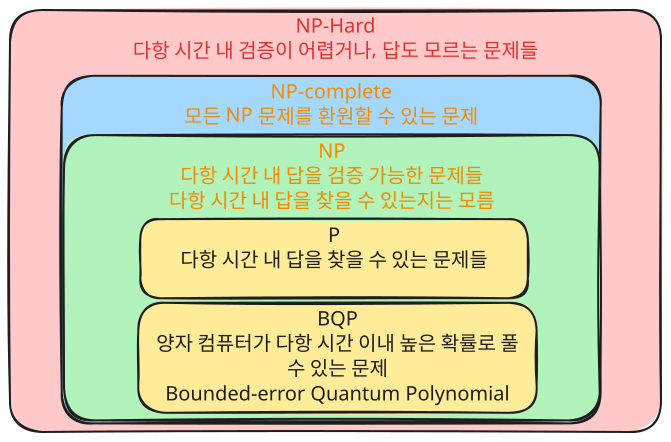

# 양자 컴퓨터에 대한 오해 
- 흔히 양자 컴퓨터가 무엇이 좋은가? 에 대한 질문에 대한 답변으로 다음과 같이 말하곤 한다. "양자 컴퓨터는 고전적 컴퓨터가 가질 수 있는 상태인 0, 1 이외에도 다른 수많은 상태를 한 번에 가질 수 있어서 동시에 모든 경로를 탐색 해 볼 수 있다. 그래서 고전적 컴퓨터가 우주의 나이보다 오래 계산해야 하는 문제를 순식간에 해결할 수 있다." 이 내용이 아예 틀린 것은 아니다. 양자 컴퓨터에서 최소 단위로 이용하는 '큐비트' 는 무수히 많은 상태를 가질 수 있고, 여러 큐비트가 '얽힘' 상태로 얽혀 있다면 지수적으로 증가하는 상태를 동시에 가질 수 있다. 그렇다면 무엇이 오해란 말인가 ? 

# 양자 컴퓨터의 한계 
- 큐비트가 무수히 많은 상태를 가지고 있어도 결국 자연은 우리에게 아주 일부분만을 보여준다. 양자 시스템을 '측정' 하는 순간 시스템은 수많은 상태 중에서 단 두 가지 중 하나의 값 만을 반환하고, 우리는 자연이 보여주는 그 극히 작은 결과를 통해 상태를 추측 할 수 있을 뿐이다. 그 외의 큐비트의 상태는 정확히 알 수 없다. 따라서 양자 컴퓨터는 모든 상태를 동시에 계산 해 보고 최적의 값을 찾아낼 수 있는 것이 아니라 양자 역학의 특성을 이용하여 확률 진폭을 증폭시켜 '확률적' 으로 최적의 값을 비교적 빠르게 찾을 수 있게 해 주는 도구이다. 물론 수학적 주기성을 이용하여 소수를 이용한 소인수 분해를 엄청나게 빠르게 찾게 해 주는 알고리즘도 있다. 우리는 이 블로그 시리즈에서 기초 지식부터 하나씩 이해하며 각 알고리즘이 어떻게 동작 하는지, 코드를 통하여 어떻게 구현하는지 알아보도록 할 것이다.

# 양자 컴퓨터로 해결하고 싶은 문제
- 우리는 살면서 수많은 문제들을 마주친다. 그 많은 삶의 다양한 문제들은 잠시 치워 두고 컴퓨터 ( 튜링 머신 ) 를 통해 계산/해결하고자 하는 문제들에만 집중 해 보자.

## 계산 복잡도 이론

- 위의 다이어그램을 보도록 하자. 어떤 문제를 해결하고 싶은지 감도 안올? 것이다. 답부터 말하자면, 양자 컴퓨터로 해결하고 싶은 문제는 P 문제를 제외한 NP 문제, 현재의 고전적 컴퓨팅 알고리즘으로는 입력값이 많아지면 기하급수적으로 계산 시간이 증가하는 문제들이다. 

## P 문제
- P 문제는 다항 시간 이내 답을 찾을 수 있는 문제이다. 다항 시간이라는 것은 입력 N 이 있을 때 문제 해결 시간이 $$ \Omega(N^k){\footnotesize  k는 상수} $$ 시간 이내인 문제들이다. P 문제에 해당하는 문제들로는 정렬, 최단 경로 찾기 등의 문제가 있다. 

## BQP 문제
- BQP 문제는 양자 컴퓨터가 매우 효율적으로 동작하여 다항 시간 이내 높은 확률로 답을 찾을 수 있는 소인수분해 문제를 말한다.

## NP 문제 
- 다음으로 NP 문제를 보자. NP 문제의 정의는 어떤 답을 주었을 때 이 답이 맞는지 다항 시간 이내 검증 할 수 있는 문제들이다. 다만 어떠한 문제의 '답' 을 다항 시간 이내 찾을 수 있는지는 아직 모른다. 만약 다항 시간 이내 답을 찾을 수 있는 방법을 여러분이 찾거나, 방법이 없다는 것을 증명하면 100만 달러를 벌 수 있다. 
- P 문제는 다항 시간 이내 답에 대한 검증도 가능하기 때문에 지금은 NP 의 부분집합 이다. P 문제를 제외한 NP 의 문제들로는 비 정형적 자료의 탐색 ( 건초 더미에서 바늘 찾기 ), 스도쿠 답 찾기, 소인수분해, 그래프 색칠 문제 ( 인접한 두 정점이 다른 색을 갖도록 모든 정점을 칠할 수 있는 최소 색 찾기 ), 외판원 문제 ( 존재 여부 확인 버전 ) 그리고 명제가 참일 수 있는 값이 할당 가능한지 묻는 SAT 문제가 있다. 

## NP-Complete 문제
- NP-Complete 문제는 모든 NP 문제를 하나로 환원할 수 있는 문제다. 환원 한다는 것은 어떠한 문제를 다른 문제로 변환이 가능하다는 뜻이다. SAT 문제로 예를 들어 보자. SAT 문제는 ( A or Not B ) And ( B or not C ) 와 같은 명제가 있을 때 이 명제를 참으로 만들 수 있는 A, B, C 값의 조합이 존재하는지 에 대한 문제이다. 분명 A, B, C 가 주어졌을 때 이 명제가 참이 되는지는 다항 시간 이내 검토가 가능하지만, 현재로서는 A, B, C 의 조합을 하나씩 수행 해 보면서 결과를 찾아야 하는 지수적 복잡도를 가진 문제로 보인다. 
- 다시 환원으로 돌아와서, NP 문제의 정의를 다시 보자. NP 문제는 다항식 시간 이내 답을 검증할 수 있는 논리 회로가 존재하는 문제이다. 이를 다시 쓰면 어떠한 입력이 제공 되었을 때 이 결과값이 YES 가 되는지 알 수 있는 논리 회로가 있다는 것이고. 그 입력을 찾는 것이 SAT 문제이므로, 논리적으로 봤을 때 모든 NP 문제는 SAT 문제로 환원 가능하다. 

## NP-Hard 문제
- 마지막 NP-Hard 문제가 남았다. NP-Hard 문제는 NP 문제를 포함하면서, NP 문제보다 더 어려운 문제들 즉 다항 시간 이내 답에 대한 검증도 못하고 답이 있지도 않은 문제들이다. 예를 들면 튜링의 정지 문제, 최단 경로를 찾는 외판원 문제 그리고 QBF 문제가 있다. 

# 양자 컴퓨터의 다른 응용
- 복잡한 계산을 해결하기 위한 컴퓨팅 분야 이외에도 양자 컴퓨터의 특성을 이용하거나 양자 역학을 응용한 다른 분야들도 있다. 본 포스트 시리즈에서는 다루지 않지만, 이러한 응용도 있다는 정도로 참고하면 좋을 것 같다. 

## 양자 암호화 (Quantum Cryptography)
- 위에서 살펴본 것처럼 양자 컴퓨터는 소인수분해를 매우 빠르게 수행할 수 있다. 이는 현재 인터넷 보안의 근간이 되는 RSA 암호 체계가 위협받는다는 뜻이다. RSA 는 '큰 수의 소인수분해는 고전적 컴퓨터로 사실상 불가능하다' 는 가정에 기반하고 있기 때문이다. 양자 암호화는 이 위협에 대한 대응이자, 동시에 양자 역학의 원리를 이용하여 도청이 물리적으로 불가능한 암호 체계를 구축하는 분야이다. 대표적으로 BB84 프로토콜이 있는데, 이는 양자 상태를 측정하면 상태가 붕괴되는 성질을 이용하여 누군가 통신을 엿보는 순간 즉시 감지할 수 있게 해 준다.

## 양자 통신 (Quantum Communication)
- 양자 통신은 양자 얽힘과 양자 상태를 이용하여 정보를 전달하는 기술이다. 가장 유명한 예시로 양자 텔레포테이션이 있다. SF 영화처럼 물체를 순간이동 시키는 것이 아니라, 얽힌 두 큐비트를 이용하여 양자 상태 정보를 원격지로 전달하는 프로토콜이다. 이 과정에서 고전적 통신 채널도 함께 필요하기 때문에 빛보다 빠른 통신은 아니지만, 양자 암호화와 결합하면 이론적으로 완벽하게 안전한 통신 네트워크를 구축할 수 있다. 현재 중국의 묵자호 위성 실험 등을 통해 장거리 양자 통신의 가능성이 실증되고 있다.

## 양자 머신러닝 (Quantum Machine Learning)
- 양자 머신러닝은 양자 컴퓨터의 고차원 상태 공간을 머신러닝에 활용하는 분야이다. N 개의 큐비트는 $$ 2^N $$ 차원의 힐베르트 공간에서 동작하기 때문에, 고전적 컴퓨터로는 표현하기 어려운 고차원 특징 공간에서의 데이터 분류나 패턴 인식이 가능할 수 있다. 예를 들어 변분 양자 회로 (Variational Quantum Circuit) 를 이용한 분류기는 파라미터화된 양자 회로를 고전적 옵티마이저로 학습시키는 하이브리드 방식이다. 아직 고전적 머신러닝 대비 명확한 양자 우위가 증명된 실용적 사례는 적지만, 활발히 연구되고 있는 분야이다.

## 양자 시뮬레이션 (Quantum Simulation)
- 사실 양자 컴퓨터의 가장 원초적인 동기가 바로 양자 시뮬레이션이다. 리처드 파인만이 1981년에 "자연은 양자역학적이니, 자연을 시뮬레이션하려면 양자 컴퓨터가 필요하다" 고 말한 것이 양자 컴퓨팅의 시작점이다. 분자의 에너지 상태, 화학 반응의 경로, 신소재의 물성 등을 정확히 시뮬레이션하려면 전자들의 양자역학적 상호작용을 모두 계산해야 하는데, 이는 고전적 컴퓨터로는 전자 수가 늘어날수록 기하급수적으로 불가능해진다. 양자 컴퓨터는 자연과 같은 양자 시스템이기 때문에 이러한 시뮬레이션을 훨씬 효율적으로 수행할 수 있으며, 신약 개발이나 배터리 소재 탐색 등에서 혁신적인 돌파구가 될 것으로 기대된다.

# 정리, 다음 포스팅
- 양자 컴퓨팅의 본격적 시작에 앞서 양자 컴퓨팅이 해결하는 문제가 무엇인지 알아 보았습니다. 다음으로 양자 역학의 기본적 지식과 양자 컴퓨터의 물리적 구현에 대한 기초적인 내용에 대하여 알아보도록 하겠습니다. 
양자 컴퓨터는 어떻게 만드는데 ? - 양자 역학의 공리

# 양자 컴퓨팅 시리즈 링크
- [시리즈 소개, 포스트 모음 링크](/posts/Quantum-Computing-00-introduction/)